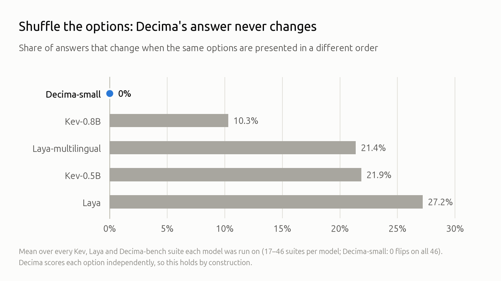

# Decima — an open, CPU-sized Jev-style decision model

**A small decision model: situation + question + your options → calibrated probabilities.**
Like TypeSafe's Jev, Decima is a *System One* model: typed decisions with probabilities instead of generated
text. Unlike Jev, it is open (Apache-2.0), 122M parameters, and runs on one CPU core or in your browser.

Built by **A. M. Madani** ([@amyrmahdy](https://github.com/amyrmahdy) · [amyrmahdy.github.io](https://amyrmahdy.github.io)).

Decima does not write text. It decides: routing, triage, intent, classification, verification,
ranking — any bounded choice your software needs to make, with a confidence it can threshold.

- **122M parameters**, ONNX int8, **~20 ms** per decision on one laptop CPU core (4 options, short input)
- **Options in plain text**, given at call time; evaluated in 20 languages (weakest: Swahili, Hindi)
- **Order-proof** — shuffling the options never changes the answer (0 %; the four other open decision models we compared: 10–27 %)
- **Well calibrated as shipped** — lowest calibration error as shipped in every pairwise comparison we ran
  (ECE 0.056–0.063 vs 0.117–0.370)

[Model on Hugging Face](https://huggingface.co/amyrmahdy/decima-small) · [Technical report](docs/TECHNICAL-REPORT.md) · [Evaluation & claims audit](docs/EVAL.md) · [x86 benchmark](docs/BENCH-x86.md) · [Playground](https://huggingface.co/spaces/amyrmahdy/decima-playground) · [Predictions dataset](https://huggingface.co/datasets/amyrmahdy/decima-bench-predictions) · [Synthetic training data](https://huggingface.co/datasets/amyrmahdy/decima-synthetic-decisions)



## Install

```bash
pip install "git+https://github.com/amyrmahdy/decima"      # from source (tag v1.0.0)
```

The runtime (`decima.Decima`) imports no PyTorch and needs no GPU — ONNX Runtime, numpy and a
tokenizer. The package as it stands still installs the training stack as well (torch,
sentence-transformers, datasets), because runtime and training share one `pyproject.toml`. A
runtime-only package without the training dependencies is planned.

## Use

```python
from decima import Decima, Question

decima = Decima.from_pretrained("amyrmahdy/decima-small")   # int8 ONNX, ~140 MB, one CPU thread

# outputs below are real (Decima-small int8, export/v1i-int8)
q = Question("Which team should handle this request?",
             ["billing", "technical support", "sales", "account security"])

decima.decide("Someone logged into my account from another country.", q)
# → {'billing': 0.004, 'technical support': 0.033, 'sales': 0.001, 'account security': 0.962}

decima.decide("یک نفر از کشور دیگری وارد حسابم شده است.", q)   # the same message in Persian
# → {'billing': 0.011, 'technical support': 0.03, 'sales': 0.003, 'account security': 0.956}
```

Four question kinds: `choose` (one of N) · `score` (ordered levels) · `verify` (yes/no) · `rank`
(independent probability per option). State, question and options may be in different languages.
`Question(..., lang="fa")` (or `"ar"`) turns on Persian/Arabic text normalisation; for the Persian
example above the output is the same with or without it.

## How it compares

| | Decima-small | Kev-0.5B | Kev-0.8B | Laya | Laya-multilingual |
|---|---:|---:|---:|---:|---:|
| Parameters | **122M** | 494M | 753M | 421M | 322M |
| Laya's MASSIVE + XNLI protocol, re-run by us (29 suites, 19 languages; in-distribution for Decima¹) | **0.764** | 0.527 | — | 0.445 | 0.607 |
| Kev's published protocol, re-run by us (8 suites) | 0.768 | 0.779 | **0.794** | 0.681 | 0.580 |
| Answer changes when options are shuffled² | **0 %** | 22 % | 10 % | 27 % | 21 % |

¹ Decima trained on the MASSIVE train split (all 51 locales; test rows differ) and on the XNLI/MNLI train
splits; Laya reports it did not train on MASSIVE or XNLI.
² Mean over the Kev, Laya and Decima-bench suites each model was run on.

All models run by us on one harness; competitors' published numbers were reproduced (to within 0.001)
first. Decima trained on the train splits of several of these datasets — see [docs/EVAL.md](docs/EVAL.md)
for what is zero-shot, what is in-distribution, and the limitations (long multi-fact business
decisions, knowledge-heavy questions). Not recommended for tool-call or shell-command safety.

## Reproduce Decima's numbers

Every system's predictions, including Decima's and the competitors', are downloadable in
[decima-bench-predictions](https://huggingface.co/datasets/amyrmahdy/decima-bench-predictions), with the
scores and a text-free manifest of every item; its card has the commands to re-score every table without
running a model. Decima's predictions can also be regenerated from the released weights and the frozen
item builders:

```bash
uv sync
# item sets (calibration items per suite: kev/laya 300, decima 500, typed 1000, others none)
uv run python -m bench.items --suites 'kev/*'    --calib 300  --out runs/items/kev.jsonl
uv run python -m bench.items --suites 'laya/*'   --calib 300  --out runs/items/laya.jsonl
uv run python -m bench.items --suites 'decima/*' --calib 500  --out runs/items/decima.jsonl
uv run python -m bench.items --suites 'jevbench/*' 'typed/*' --calib 1000 --out runs/items/jevtyped.jsonl
uv run python -m bench.items --suites 'btzsc/*'               --out runs/items/btzsc.jsonl
# predictions (int8 ONNX, 1 thread) and scores, one set at a time
for s in kev laya decima jevtyped btzsc; do
  uv run python -m bench.predict --items runs/items/$s.jsonl --system onnx --checkpoint export/v1i-int8 \
      --threads 1 --out runs/preds/$s--decima.jsonl
  M=acc; [ $s = btzsc ] && M=macro_f1
  uv run python -m bench.score --items runs/items/$s.jsonl --metric $M --preds decima=runs/preds/$s--decima.jsonl
done
# audit numbers: overlap, confidence intervals, headline calibration
uv run python scripts/audit/overlap.py && uv run python scripts/audit/bootstrap.py && uv run python scripts/audit/calibration.py
```

`export/v1i-int8` is the int8 ONNX export; the same files are `onnx/int8/` in the
[model repository](https://huggingface.co/amyrmahdy/decima-small)
(`hf download amyrmahdy/decima-small --include 'onnx/int8/*' --local-dir decima-small`, then pass
`--checkpoint decima-small/onnx/int8`). Parameter counts for every system:
`uv run python scripts/audit/params.py`. Competitor predictors (Laya, Kev) run in their own environments: `bench/external/`. Training recipe,
data builders and every experiment — including the ones that failed — are in the
[technical report](docs/TECHNICAL-REPORT.md).

## Repository

| | |
|---|---|
| `decima/` | model, ONNX runtime, export, int8 quantisation |
| `train/` | training (distillation + gold labels, crash-safe checkpoints) |
| `teacher/` | teacher data generation and gold-label builders |
| `bench/` | evaluation harness: one item format for every system, scorer, speed |
| `docs/` | technical report, evaluation audit, benchmarks |

## License & citation

Code and model: [Apache-2.0](LICENSE). Synthetic dataset: CC BY 4.0. Training-data licences
(some non-commercial) are disclosed in the model card and `release/LICENSING.md`. Predictions dataset:
CC BY 4.0.

If you use Decima, please cite it (GitHub's "Cite this repository" reads [`CITATION.cff`](CITATION.cff)):

```bibtex
@misc{madani2026decima,
  title  = {Decima: A Small, Calibrated, Permutation-Invariant Decision Model via Late-Interaction Distillation},
  author = {Madani, A. M.},
  year   = {2026},
  howpublished = {\url{https://github.com/amyrmahdy/decima}},
  note   = {Model: \url{https://huggingface.co/amyrmahdy/decima-small}}
}
```

Questions and problems: [GitHub issues](https://github.com/amyrmahdy/decima/issues).
