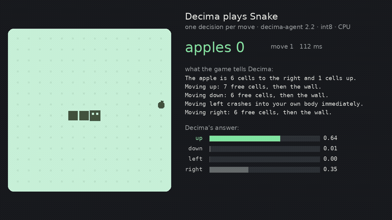

# Decima

**Small local judges for LLM systems.** Give Decima a situation, a question and your options; it returns calibrated
probabilities in milliseconds, on a CPU, with nothing leaving your machine.

```bash
pip install decima-ai
```

```console
$ decima "Your API has been returning 500 errors for an hour and our checkout is down!" --preset triage
decima-base · triage
category   technical                         ███████████████████▌ 0.97
urgency    2 Now: the writer or their busi…  ██████████████████▌  0.92
sentiment  negative                          ███████████████████▍ 0.97

$ decima "rm -rf ~/projects/app" --preset agent-gate
decima-agent · agent-gate
gate       deny   ███████████████████▋ 0.98
read_only  no     ▎                    0.01  p(yes)

$ decima "I was charged twice for my subscription" --question "Which team?" --choices billing,technical,sales
decima-base · 81 ms
answer  billing    ██████████████████▉  0.94
        technical  ▉                    0.05
        sales      ▏                    0.01
```

(Outputs shortened to the top answer per question; the CLI also prints the runners-up.)

Decima is the judge, not the writer. Put it next to your LLM, agent or extraction pipeline to decide what is safe, what
is true, where a request should go, and when the expensive model is really needed. It speaks TypeSafe's
`/v1/systemone` format (`choice`, `noul`, `score`), so code written for Jev works after a one-line change, and it ships
in [Ollaya](https://ollaya.dev/library/decima).

- **Local and cheap:** int8 ONNX, about 20–50 ms per decision on one CPU core. No GPU, no API key, no data leaves.
- **Calibrated:** 0.8 means right about 80 % of the time, so you can threshold, abstain, or escalate to a bigger model.
- **Order-proof:** shuffling the options never changes the answer (0 %; other open models in our tests: 10–27 %).
- **Your options, at call time:** any labels, any number. Multilingual backbone; evaluated in 20 languages.

## Use it

**Command line**

```bash
decima "I was charged twice for my subscription" --question "Which team?" --choices billing,technical,sales
decima --file ticket.txt --preset triage --json
decima presets                                   # triage, guardrails, moderation, routing, pii, agent-gate, kg-judge
```

**Python**

```python
from decima import Router

router = Router()                                  # downloads the int8 model on first use
answer = router.predict(
    {"message": "Someone logged into my account from another country and changed my password."},
    {"team":   {"type": "choice", "instructions": "Which team should handle this?",
                "criteria": {"billing": "charges and refunds", "tech": "bugs and errors", "security": "account takeover"}},
     "urgent": {"type": "noul", "instructions": "The customer needs help within the hour."}},
)
print(answer["answers"]["team"]["choice"], answer["answers"]["urgent"]["noul"])     # security 0.72
```

**HTTP server** (TypeSafe-compatible, binds to 127.0.0.1)

```bash
decima serve --model decima-agent --port 11436
```

The official `typesafe-sdk` works against it unchanged: `TypeSafeClient(api_key="local", base_url="http://127.0.0.1:11436")`.

**Integrations:** [Claude Code hooks](integrations/claude-code) (secret and command gates, rules first, fail closed) ·
[MCP server](integrations/mcp) (`decima mcp`) · [LangChain / LangGraph](integrations/langchain) ·
[Docker](Dockerfile) · [examples](examples) · [Colab quickstart](examples/quickstart.ipynb)

## Presets

| Preset | Decides | Model |
|---|---|---|
| `triage` | team, urgency, sentiment of a ticket or message | decima-base |
| `routing` | cheapest LLM tier that can answer well: small / medium / frontier | decima-base |
| `moderation` | which policy a post breaks, and how badly | decima-base |
| `pii` | is there personal data, and of which kind | decima-base |
| `guardrails` | prompt injection or jailbreak, personal data, toxicity before a prompt reaches an LLM | decima-agent |
| `agent-gate` | allow / ask / deny a shell command, secret in an edit, model tier for a task | decima-agent |
| `kg-judge` | is a fact asserted, hypothetical, denied or planned; are two records one entity; how two things relate | decima-agent |

Presets are JSON files in [`decima/presets`](decima/presets); write your own with any questions.

## Models

| Model | Size | For |
|---|---|---|
| [decima-agent](https://huggingface.co/amyrmahdy/decima-agent) 2.2 | 321M | agent gates and knowledge-graph judgments; states up to 2,048 tokens |
| [decima-base](https://huggingface.co/amyrmahdy/decima-base) 2.0 | 321M | general decisions, multilingual |
| [decima-small](https://huggingface.co/amyrmahdy/decima-small) 1.1 | 122M | the smallest CPUs and the browser |

## How good is it

Honest numbers, on data the models never trained on unless stated.

**Against the same-size open models**, all re-run by us on one harness:

| | decima-base | decima-small | Laya | Laya-multilingual | Kev-0.8B |
|---|---:|---:|---:|---:|---:|
| Parameters | 321M | **122M** | 421M | 322M | 753M |
| jabr/classifier-benchmark v2, 49 tasks (zero-shot) | **0.673** | 0.616 | 0.583 | — | — |
| Kev's published protocol, 8 suites | 0.790 | 0.762 | 0.681 | 0.580 | **0.794** |
| Answer changes when options are shuffled | **0 %** | **0 %** | 27 % | 21 % | 10 % |

Decima trained on the train splits of some suites in Kev's protocol (test rows differ); jabr is zero-shot. The
frontier is much higher: Jev scores 0.966 on jabr v2, and 4B–27B open models (Kev, SemIf-OpenJev) report Jev-level accuracy on their own tests. Decima wins
on cost, speed and locality, not on hard open-ended judgment.

**As a local stand-in for Jev in a published knowledge-graph pipeline**
([William Lyon's notebooks](https://github.com/johnymontana/extraction-knowledge-graph-experiments), same questions):

| | Jev | decima-agent 2.2 (CPU) |
|---|---:|---:|
| Planted "maybe / denied / planned" facts caught | 8/11 | **11/11** |
| Entity matching (Beer, 450 pairs), AUC | **0.992** | 0.972 |
| Assertion gate over extracted edges, F1 | **0.404** | 0.368 |
| Extraction ∪ relation selection, gated, F1 | 0.343 | **0.364** |

**As a gate for a coding agent**, on 40 cases written after training with no copies in any training data:
decima-base 0.60 → decima-agent 2.2 **0.85**. Keep hard rules first; the [hooks](integrations/claude-code) do.

**It also plays games** from text sensors, one decision per move: Snake, 42 apples a game (6 of 10 games alive at the
600-move limit); a side-scrolling platformer, 9 of 10 levels.



## Limitations

- Fuzzy, knowledge-heavy or multi-step decisions belong to a bigger model. Use Decima's confidence to know when.
- States are limited to 512 tokens (decima-base) or 2,048 (decima-agent); longer input is refused, never silently cut.
- A model can be confidently wrong. For safety gates, keep rules first and Decima second.
- decima-base trained on some non-commercial datasets; see [release/LICENSING.md](release/LICENSING.md) before selling
  a product built on it.

## Reproduce Decima's numbers

Every system's predictions, including Decima's and the competitors', are downloadable in
[decima-bench-predictions](https://huggingface.co/datasets/amyrmahdy/decima-bench-predictions), with the
scores and a text-free manifest of every item; its card has the commands to re-score every table without
running a model. Decima's predictions can also be regenerated from the released weights and the frozen
item builders:

```bash
uv sync
# item sets (calibration items per suite: kev/laya 300, decima 500, typed 1000, others none)
uv run python -m bench.items --suites 'kev/*'    --calib 300  --out runs/items/kev.jsonl
uv run python -m bench.items --suites 'laya/*'   --calib 300  --out runs/items/laya.jsonl
uv run python -m bench.items --suites 'decima/*' --calib 500  --out runs/items/decima.jsonl
uv run python -m bench.items --suites 'jevbench/*' 'typed/*' --calib 1000 --out runs/items/jevtyped.jsonl
uv run python -m bench.items --suites 'btzsc/*'               --out runs/items/btzsc.jsonl
# predictions (int8 ONNX, 1 thread) and scores, one set at a time
for s in kev laya decima jevtyped btzsc; do
  uv run python -m bench.predict --items runs/items/$s.jsonl --system onnx --checkpoint export/v1i-int8 \
      --threads 1 --out runs/preds/$s--decima.jsonl
  M=acc; [ $s = btzsc ] && M=macro_f1
  uv run python -m bench.score --items runs/items/$s.jsonl --metric $M --preds decima=runs/preds/$s--decima.jsonl
done
# audit numbers: overlap, confidence intervals, headline calibration
uv run python scripts/audit/overlap.py && uv run python scripts/audit/bootstrap.py && uv run python scripts/audit/calibration.py
```

`export/v1i-int8` is the int8 ONNX export; the same files are `onnx/int8/` in the
[model repository](https://huggingface.co/amyrmahdy/decima-small)
(`hf download amyrmahdy/decima-small --include 'onnx/int8/*' --local-dir decima-small`, then pass
`--checkpoint decima-small/onnx/int8`). Parameter counts for every system:
`uv run python scripts/audit/params.py`. Competitor predictors (Laya, Kev) run in their own environments: `bench/external/`. Training recipe,
data builders and every experiment — including the ones that failed — are in the
[technical report](docs/TECHNICAL-REPORT.md).

## Repository

| | |
|---|---|
| `decima/` | ONNX runtime, Router, presets, CLI, server, MCP, LangChain helpers; model, export, int8 quantisation |
| `integrations/` | Claude Code hooks, MCP, LangChain |
| `examples/` | runnable examples and a Colab quickstart |
| `train/` | training (distillation + gold labels, crash-safe checkpoints) |
| `teacher/` | teacher data generation and gold-label builders |
| `bench/` | evaluation harness: one item format for every system, scorer, speed |
| `docs/` | technical report, evaluation audit, benchmarks |

## License & citation

Code and model: [Apache-2.0](LICENSE). Synthetic dataset: CC BY 4.0. Training-data licences
(some non-commercial) are disclosed in the model card and `release/LICENSING.md`. Predictions dataset:
CC BY 4.0.

If you use Decima, please cite it (GitHub's "Cite this repository" reads [`CITATION.cff`](CITATION.cff)):

```bibtex
@misc{madani2026decima,
  title  = {Decima: A Small, Calibrated, Permutation-Invariant Decision Model via Late-Interaction Distillation},
  author = {Madani, A. M.},
  year   = {2026},
  howpublished = {\url{https://github.com/amyrmahdy/decima}},
  note   = {Models: \url{https://huggingface.co/amyrmahdy}}
}
```

Questions and problems: [GitHub issues](https://github.com/amyrmahdy/decima/issues).
