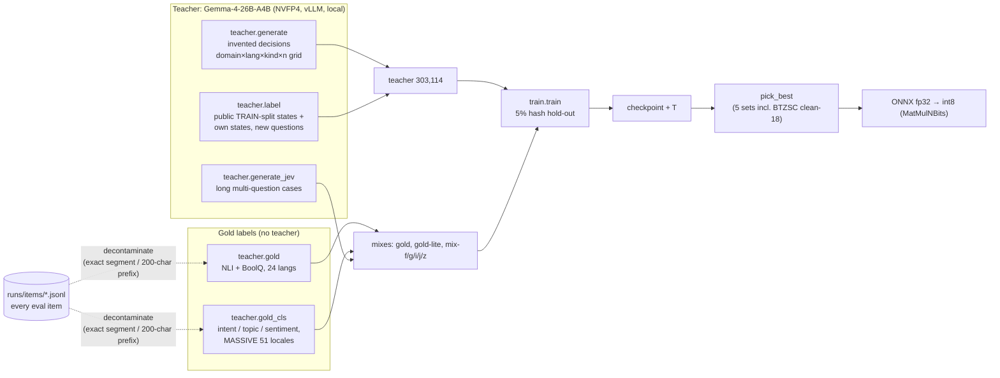
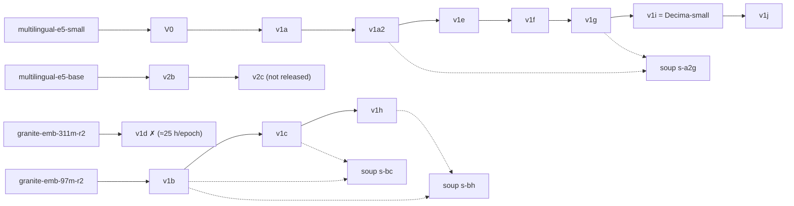

# Decima: A Small, Calibrated, Permutation-Invariant Decision Model via Late-Interaction Distillation

**A. M. Madani** ([@amyrmahdy](https://github.com/amyrmahdy); independent; [amyrmahdy.github.io](https://amyrmahdy.github.io)) · Technical report, v1.0.0, 2026-09-27

Code: [github.com/amyrmahdy/decima](https://github.com/amyrmahdy/decima) · Model:
[huggingface.co/amyrmahdy/decima-small](https://huggingface.co/amyrmahdy/decima-small) · Evaluation audit:
[docs/EVAL.md](EVAL.md)

<!--
Source policy for this document: every number is taken from a file in this repository, named next to it
(an HTML comment, a table "Source" line, or a footnote). Where a number is computed from a file (a sum,
a slope, a mean over suites) the computation is stated. Claims follow the allowed/forbidden list in
docs/EVAL.md §5. Numbers are fp32 PyTorch on the GX10 GPU unless the text says otherwise.
-->

---

## Abstract

We describe Decima-small, a 122M-parameter model (26.4M parameters outside the multilingual token-embedding
table) that maps a *state* (free text), a *question* and a set of *options supplied at call time* to a
calibrated probability for each option. Decima does not generate text. It encodes the question and state
once and each option once, and scores every option through a small late-interaction scorer: two decoder-style
layers in which the option's tokens cross-attend to the state tokens. The design has three consequences that
we prove or measure. (i) The output is exactly equivariant to option order, so the answer never changes when
options are shuffled (flip rate 0.000 on every suite, against per-set means of 0.014–0.489, or 10–27 % as a
mean over suites, for the four open decision models we compared).
(ii) The number of options is not bounded by a context window, and option encodings are cacheable, so the
cost is one state encoding plus about 1 ms per extra option on one x86 core (int8). (iii) A cumulative-link
ordinal head, with thresholds derived from the level texts, handles ordered choices. The model is distilled
from probability distributions (full for short option lists, top-k for large catalogues) produced by a 26B
mixture-of-experts teacher over a domain × language × kind × cardinality grid, then fine-tuned on
gold-labelled train splits. Under the competitors' published protocols, re-run by us and reproducing their
published numbers to within 0.001, Decima-small scores 0.764 on Laya's 29-suite MASSIVE + XNLI protocol (Laya
0.445, Laya-multilingual 0.607; Decima trained on the MASSIVE and XNLI/MNLI train splits, Laya reports it did
not) and 0.768 on Kev's 8-suite protocol (Kev-0.5B 0.779, Kev-0.8B 0.794). On both protocols Decima is
*in-distribution*: it trained on the train splits of MASSIVE, XNLI/MNLI, banking77, AG News, SST-5 and BoolQ.
Its probabilities as shipped have the lowest calibration error in every pairwise comparison we ran (mean
per-suite ECE 0.056–0.063 against 0.117–0.370). It is weak on long, multi-fact business decisions: on
typed-decisions it and every other small model we tested sit below the majority-class baseline. On the
strictly zero-shot BTZSC subset (18 datasets) the final model scores 0.570 macro-F1, *below* our first
distilled model (0.586). We report a complete experimental lineage of about 15 training runs, including the
negative results: data that raises in-distribution scores can lower zero-shot scores, weight-space soups did
not help, a long-context backbone collapsed on low-resource languages, and plain dynamic int8 agreed with
fp32 on only 88 % of real items until we moved to block-wise 8-bit weights and activations in the encoder.

---

## 1 Introduction

Many production systems need a *decision* rather than a text: which queue a ticket goes to, which intent
an utterance expresses, whether a retrieved passage supports a claim. Generative LLMs can make these
decisions by prompting, but the output is a token sequence that has to be parsed into a label. A confidence
has to be derived from token probabilities (of the label's first token, or of the whole label under
constrained scoring), and the answer can depend on where each option appears in the prompt. A *decision model* is trained to do only this
mapping, $(\text{state}, \text{question}, \text{options}) \mapsto p \in \Delta^{n-1}$, with the options
written in natural language at call time.

Three recent systems target this interface and are our points of comparison. Jev [1] is the reference system of
the JevBench [2] and Jev Decision Index (JDI) [3] benchmarks. Its board score is JDI 59.51 <!-- src: docs/EVAL.md §4g -->.
Laya [4] (421M parameters) and Laya-multilingual (322M) are open models. Kev-0.5B (494M) and Kev-0.8B (753M) [5] are
open LoRA-plus-head models on Qwen backbones <!-- src: docs/EVAL.md §6; scripts/audit/params.py -->.

Decima asks how far a *small* encoder can go on this interface, and what a careful answer needs besides the
model: a harness that reproduces competitors' published numbers (to within 0.001) before comparing, a measured
contamination audit, and a selection rule that does not quietly give up zero-shot ability.

**Contributions.**

- **A formulation and an architecture with exact permutation invariance.** A late-interaction option scorer [6]
  on a multilingual-E5-small encoder [7]. Each option's score is a function of the state and *that option only*,
  so reordering options permutes the output distribution identically (§3.4). A bi-encoder cosine skip term,
  with the learned head initialised to zero, makes training start *exactly* at the zero-shot baseline (§3.2).
- **A cumulative-link ordinal head** [8] **whose thresholds are derived from the level texts**, increasing
  by construction (§3.3).
- **A distillation recipe** [9] **that uses teacher distributions**, not argmax labels (full distributions for short
  option lists; top-k with uniform remainder for large catalogues and relabelled rows), over a seeded
  domain × language × kind × cardinality grid with "none of the above" options. It is combined with relabelled
  public train-split states, long multi-question "Jev-style" cases, and gold NLI, reading-comprehension,
  intent, topic and sentiment data. The gold-labelled data were decontaminated against every evaluation
  item; the teacher-relabelled file was not, and it carries every measured overlap (§4.5).
- **An evaluation harness built to be defensible.** One item format for all systems. Competitor protocols
  are re-implemented and verified to reproduce the published numbers before any comparison. We add an
  option-order flip test, per-suite calibration with temperatures fitted only on non-test splits, cluster
  bootstrap intervals, a measured exact-text overlap audit, and a selection score that includes a strictly
  zero-shot benchmark, BTZSC [10] (§6).
- **A full lineage with negative results** (§8), and a quantisation analysis. Plain dynamic int8 loses
  accuracy (88% top-1 agreement with fp32 on real items) because of activation outlier channels in the
  encoder. Block-wise 8-bit weights *and* activations in the encoder fix it (the scorer keeps per-channel
  dynamic int8): int8 top-1 agreement with fp32 is 98.6–99.8% on 45,850 real items, and the model is 3.8×
  smaller (§8.8, §9).

---

## 2 Problem formulation

A **decision** is a tuple $(x, q, \mathcal{C}, \kappa)$:

- a state $x$: arbitrary text such as a ticket, log excerpt, JSON payload or document;
- a question $q$;
- an option set $\mathcal{C} = (c_1, \dots, c_n)$ of natural-language strings chosen at inference time, with
  $n \ge 1$ and no fixed label vocabulary;
- a kind $\kappa \in \{\texttt{choose}, \texttt{verify}, \texttt{score}, \texttt{rank}\}$
  <!-- src: decima/types.py -->.

| kind | semantics | output |
|---|---|---|
| `choose` | exactly one of $n$ mutually exclusive options | distribution on the simplex $\Delta^{n-1}$ |
| `verify` | a proposition is true or false; $n = 2$ | distribution over (yes, no) |
| `score` | one of $K$ **ordered** levels, listed lowest → highest | ordinal distribution over levels |
| `rank` | each option independently applies or not | $n$ independent probabilities in $[0,1]$ |

We require the following:

1. **A calibrated distribution.** The output is a probability vector whose confidence can be thresholded
   ("act automatically above 0.9, escalate the rest"). We measure expected calibration error (ECE, 15
   equal-width bins on top-1 confidence) both as shipped and after per-suite temperature scaling [11] (§6.4).
2. **Permutation invariance as a design requirement.** For `choose`, `verify` and `rank`, the options are
   an unordered set. If $\pi$ permutes the options, the model must satisfy
   $p(x, q, \pi\mathcal{C}) = \pi\, p(x, q, \mathcal{C})$. For `score` the order carries meaning (it *is*
   the ordinal scale), so invariance is neither expected nor tested.
3. **Runtime option sets of any size.** The same model must handle 2 options and 1,000 options, in
   different languages than the state (e.g. a Persian utterance against English intent names).

---

## 3 Architecture

### 3.1 Overview

```
                      ┌───────────────────────────── state side (once per (state, question)) ─────────────┐
 question q ──┐       │                                                                                   │
 state x  ────┴──► "query: " ν(q ⏎ x) ──► E5 encoder (12 × 384, shared) ──► H_s ∈ R^{L_s×d},  L_s ≤ 512  │
                      └───────────────────────────────────────────────────────┬──────────┬───────────────┘
                                                                              │ keys /   │ mean-pool
                                                                              │ values   ▼
 option c_k ──► "passage: " ν(q ␣ c_k) ──► E5 encoder (shared) ──► H_k ──► ┌─┴──────────────────────────┐
               (once per option set; cached)                     L_k ≤ 64  │ scorer layer × 2           │
                                                                   │       │  X ← X + SelfAttn(LN X)    │  (within option k only)
                                                                   │       │  X ← X + CrossAttn(LN X,H_s)│
                                                                   │       │  X ← X + FFN(LN X)         │
                                                                   │       └─┬──────────────────────────┘
                                                                   │         │ LN, masked mean → z_k ∈ R^d
                                                                   ▼         ▼
                                    s_k = wᵀz_k + b  +  α · (cos(h̄_s, h̄_k) − β)      (w = b = 0 at init)
                                                                   │
                         ┌─────────────────────────┬───────────────┴─────────┬─────────────────────────┐
                    choose / verify              score                      rank
                    softmax(s / T)       cumulative link on (s, z)      σ(s_k / T) per option
```

**Encoder.** `intfloat/multilingual-e5-small` (12 layers, $d = 384$), fine-tuned in full. It has 21,639,552
non-embedding parameters and a 96,014,208-parameter token-embedding table. The scorer and heads add
4,735,109 parameters, for 122,388,869 in total <!-- src: docs/EVAL.md §6; runs/train-v1i.jsonl start.params -->.
The scorer count follows from the layer shapes: each layer has two attention blocks of
$4(d^2 + d) = 591{,}360$ parameters, an FFN $384 \to 1536 \to 384$ of 1,181,568 and three LayerNorms of
2,304, so $2 \times 2{,}366{,}592 = 4{,}733{,}184$. The output norm, score projection, two ordinal
projections and the two skip scalars add 1,925 <!-- computed from decima/model.py -->. Persian and Arabic
text passes through a script normaliser $\nu$ before tokenisation: letter-form unification, removal of
tashkeel and tatweel, and ASCII digits <!-- src: decima/normalize.py -->.

**Text layout.** The shipped layout ("question on both sides") encodes `query: ` $\nu(q \,⏎\, x)$ on the
state side, with the question first so that truncating a long state cuts its tail and never the question.
On the option side it encodes `passage: ` $\nu(q \,␣\, c_k)$. The limits are 512 state tokens and 64 tokens
per option <!-- src: runs/train-v1i.jsonl start.args; decima/model.py state_text/choice_text -->. §8.1 studies
this choice.

### 3.2 Late-interaction scorer and the zero-shot skip

Let $H_s \in \mathbb{R}^{L_s \times d}$ be the state token states with padding mask $m_s$, and
$H_k \in \mathbb{R}^{L_k \times d}$ those of option $k$. Starting from $X^{(0)}_k = H_k$, each of the two
pre-LayerNorm scorer layers computes

$$
\begin{aligned}
X &\leftarrow X + \mathrm{SelfAttn}\big(\mathrm{LN}(X);\, m_k\big) &&\text{(tokens of option $k$ only)}\\
X &\leftarrow X + \mathrm{CrossAttn}\big(\mathrm{LN}(X),\, H_s;\, m_s\big) &&\text{(option reads the state)}\\
X &\leftarrow X + \mathrm{FFN}\big(\mathrm{LN}(X)\big)
\end{aligned}
$$

with 6 heads, FFN width 1536, GELU and dropout 0.1. The option vector is
$z_k = \operatorname{mean}_{m_k} \mathrm{LN}(X^{(2)}_k)$, and its score is

$$
s_k \;=\; w^\top z_k + b \;+\; \alpha\,\big(\cos(\bar h_s, \bar h_k) - \beta\big),
\qquad \bar h = \text{masked mean of } H .
$$

$\alpha$ and $\beta$ are learnable scalars initialised at $\alpha = 20$ and $\beta = 0.85$, and $w$ and $b$
are initialised to **zero** <!-- src: decima/model.py __init__ -->. At initialisation, therefore,
$\mathrm{softmax}(s) = \mathrm{softmax}(\cos / 0.05)$: exactly the zero-shot bi-encoder baseline
(`decima/baseline.py`, temperature 0.05). The centring $\beta$ does not affect the softmax. It keeps
$\sigma(s_k)$ for `rank` and the ordinal latent at sensible values at initialisation, since E5 cosines
cluster near 0.85. Training therefore begins at the baseline's accuracy (mean 0.438 on the Decima bench;
README.md) rather than at chance.

**Why not a bi-encoder, and why not a cross-encoder.** A dot product cannot read the state *conditioned on
the option*: distinguishing "refund" from "refund status" needs attention over the state tokens that the
option makes relevant. A cross-encoder over the concatenation of all options does read them jointly, but
then the options compete for one context window, their positions matter, and nothing can be cached. Late
interaction is the middle point: per-option attention over the state, with no attention between options.

### 3.3 Output heads

All heads share the same scores and divide them by one temperature $T$ first, $\tilde s = s / T$, so a
single scalar calibrates every kind <!-- src: decima/model.py log_probs -->.

- **choose / verify:** $p = \mathrm{softmax}(\tilde s)$.
- **rank:** $p_k = \sigma(\tilde s_k)$, independently for each option. The values do not sum to 1.
- **score (cumulative link).** Let $K$ be the number of levels, in order. The head computes a shared latent

$$
g \;=\; u^\top \bar z + c \;+\; \Big(\textstyle\sum_{k=0}^{K-1} k\,\mathrm{softmax}(\tilde s)_k \;-\; \tfrac{K-1}{2}\Big),
\qquad \bar z = \tfrac{1}{K}\textstyle\sum_k z_k ,
$$

  which is a learned term plus the centred expected level index under the per-level scores. It then computes
  threshold gaps from **each level's own vector** and builds centred thresholds:

$$
\delta_k = \mathrm{softplus}(v^\top z_k + e) + 10^{-3} > 0, \qquad
\theta_j = \sum_{i=0}^{j} \delta_i \;-\; \tfrac12 \sum_{i=0}^{K-1} \delta_i, \quad j = 0,\dots,K-2 .
$$

  Because every $\delta_k > 0$, the thresholds satisfy $\theta_0 < \theta_1 < \dots < \theta_{K-2}$ **by
  construction**. The level probabilities are

$$
P(y > j) = \sigma(g - \theta_j), \qquad
P(y = k) = \sigma(g - \theta_{k-1}) - \sigma(g - \theta_k),
$$

  with $\sigma(g-\theta_{-1}) \equiv 1$ and $\sigma(g-\theta_{K-1}) \equiv 0$. These are non-negative because
  the thresholds are monotone, and they sum to 1 by telescoping <!-- src: decima/model.py ordinal_log_probs -->.
  Since $z_k$ is the level text *after* it has attended to the state, the spacing between levels is a
  function of the level wording (a 3-level "low / medium / high" scale and a 7-point scale get different
  spacings) and of the state. Two details matter in practice. The expected-index term bounds the initial
  latent to $\pm(K-1)/2$, so an untrained head starts mid-scale rather than on an end level. And the
  temperature acts on this head only through that term. The same head is re-implemented in NumPy in the
  ONNX runtime (`decima/runtime.py: ordinal`), with its four weight tensors shipped in `decima.json`.

### 3.4 Exact permutation invariance

**Proposition.** For $\kappa \in \{\texttt{choose}, \texttt{verify}, \texttt{rank}\}$ and any permutation
$\pi$ of the options, $p(x, q, \pi\mathcal{C}) = \pi\,p(x, q, \mathcal{C})$.

*Proof.* $H_k$ depends only on $(q, c_k)$. The scorer's self-attention runs over the tokens of a single
option, its cross-attention reads only $H_s$, and the skip term uses only $(\bar h_s, \bar h_k)$. So
$s_k = f(x, q, c_k)$ for a fixed function $f$, and no operation mixes option indices before the head.
Softmax and element-wise $\sigma$ are permutation-equivariant. $\square$

In practice, options in a set are padded to a common length, and the padding is masked (additive $-10^4$
before the attention softmax, masked mean pooling). Floating-point results can still differ in the last
bits because of batched kernels. The measured flip rate is 0.000 on every suite (§7.6). Invariance is a
property of the architecture and was not learned; we measure it anyway because the competitors' flip rates
are far from zero.

A corollary is that the option count is **unbounded**. Options never share a context window, so 1,000
options require no prompt and no truncation. The cost, however, is linear in $n$ (§3.5).

### 3.5 Cost model and caching

For one decision with $n$ options and a warm option cache,

$$
C(n) \;\approx\; C_{\text{tok}} + C_{\text{enc}}(L_s) \;+\; n \cdot C_{\text{sc}}(L_k, L_s),
\qquad
C_{\text{sc}} = O\big(L_k^2 d + L_k L_s d + L_k d\,d_{\text{ffn}}\big) \text{ per layer.}
$$

On a cache miss, $n \cdot C_{\text{enc}}(L_k)$ is added once. The runtime caches option token states per
(question text, option tuple, language). It holds up to 256 option sets and is cleared entirely when it
overflows (it is not an LRU) <!-- src: decima/runtime.py _choices; decima/model.py Decima._choices -->. With
the shipped layout the question is on both sides, so the state encoding is specific to each (state, question)
pair and the option cache is specific to each (question, options) pair. An application that asks one fixed
question over a stream of states pays only for the state encoding and the $n$ scorer passes. Measured on one
x86 core with int8 and short states, a decision takes 16 ms at 4 options, about 1 ms per extra option, and
1.06 s at 1,000 options; a cache miss costs a one-time encode of about 12 ms per option
<!-- src: docs/BENCH-x86.md §2 scaling -->. The scorer pass over all $n$ options at every call is what makes
the output order-independent. It is also why 1,000 options take about 1.06 s rather than milliseconds (§9).

The ONNX export splits the model into two graphs cached at different rates: `encoder.onnx` (token states)
and `scorer.onnx` (per decision, shape-dynamic in $n$, $L_k$ and $L_s$). The attention is re-implemented with
explicit reshapes because the exporter bakes traced shapes into `nn.MultiheadAttention`
<!-- src: decima/export.py; decima/model.py Attention docstring -->.

---

## 4 Training data



### 4.1 Teacher distillation over a grid

The teacher is Gemma-4-26B-A4B [12], served locally (NVFP4 weights, vLLM) on the training box. A pilot rejected
Qwen3-Coder-Next as teacher: 3 of 6 sample calls were unparseable and it produced no valid Persian, while
Gemma produced 60/60 valid FA/AR/RU samples <!-- src: README.md "Teacher distillation data"; git 72aae1e -->.
Two generators write the base corpus.

**`teacher.generate` invents whole decisions.** Call $i$ deterministically selects a grid cell
<!-- src: teacher/generate.py -->:

- *domain:* one of 20 business domains, e.g. support, ops routing, security and moderation,
  legal/compliance, finance, healthcare intake, agent tool choice, document QA, dev/CI
  (`teacher/prompts.py: DOMAINS`);
- *state language:* EN 30 / FA 25 / AR 25 / RU 20;
- *cross-lingual flag:* 15% of cells, with English options 70% of the time when the state is not English;
- *kind:* choose 40 / verify 22 / score 20 / rank 18;
- *cardinality:* choose $n \in \{2,3,5,8,12,20,50,100\}$, score $K \in \{3,5,7\}$,
  rank $n \in \{3,5,8,12,20\}$;
- *"none of the above":* 25% of choose cells, with the none option gold in a seeded third of that cell's
  examples.

Cells with $n \le 12$ ask for 10 examples, each with its own option list and a **full** probability vector.
Cells with $n \ge 20$ ask for one shared catalogue plus 10 states labelled with a sparse top-3–6
distribution, with the remaining mass spread over the rest. The catalogue shape matches deployment (a fixed
option set and many states) and keeps 100-option calls within the token budget. The prompt requires
calibrated, non-zero mass on plausible options, and at least a third of the examples in each call must be
genuinely ambiguous (top probability ≤ 0.6). Every returned vector is validated as a probability
distribution (renormalised only within ±2%) and rejected otherwise <!-- src: teacher/prompts.py -->.

**`teacher.label` relabels real states.** Invented states come with invented options that fit them too
neatly. The second generator takes real utterances from the **train** splits of banking77, CLINC150,
MASSIVE (en/fa/ar/ru), AG News, SST-5 and XNLI (en/ar/ru), plus our own generated states. It asks the
teacher to label them under freshly invented question-and-option sets (8 per source and option language,
plus one real-catalogue subset with "none of the above") <!-- src: teacher/label.py; teacher/sources.py -->.
Like the catalogue cells, relabelled rows carry a sparse top-3–6 distribution with the leftover mass spread
uniformly. The dataset's own label is **not** used. Test and validation splits are never read. These rows
were not decontaminated against the evaluation items (§4.5).

**Resulting corpus** (V0's training data) <!-- src: runs/logs/data-stats-v0.txt -->:

| | |
|---|---|
| examples | 303,114 (label 216,214 = 71%; generate 86,900 = 29%) |
| kinds | choose 35% · score 23% · verify 23% · rank 19% |
| state language | en 40% · ar 22% · fa 19% · ru 19%; cross-lingual 8.3% |
| choose rows with a none option | 73,683 (70% of choose); none is gold in 33% of those |
| teacher entropy (nats) / mean top-p | choose 0.636 / 0.777 · score 0.676 / 0.732 · verify 0.245 / 0.902 |
| gold = argmax | choose 0.991 · score 0.972 · verify 0.978 · rank 0.966 |
| ambiguous (top ≤ 0.6) | choose 20% · score 31% · verify 7% · rank 14% |
| state length (chars) | mean 163, p10 32, p90 279 |

Generation took about 23 hours of wall-clock time on the GX10, with both generators running concurrently.
From `data/teacher/usage.jsonl` (summed): `generate` made 9,512 calls (4.50M prompt, 17.31M completion
tokens) over 22.9 h, and `label` made 11,847 calls (15.29M prompt, 9.73M completion tokens) over 22.7 h.

### 4.2 Jev-style long multi-question cases

The first-generation states are short (mean 163 characters), while the decisions Decima was weakest on are
300–1,500-word artefacts: alert payloads, email threads, invoices, agent tool traces, retrieved passages
plus a query, proposed tool calls. `teacher.generate_jev` asks for one long state and 3–5 independent
questions per call, and stores one row per question with a shared `group` id <!-- src: teacher/generate_jev.py -->.

- *Grid:* state language EN 70 / FA 10 / AR 10 / RU 10; kinds choose 45 / verify 30 / score 25; about 15% of
  choose questions carry a none or "insufficient information" option; 30% of questions are asked to be
  genuinely uncertain.
- *Domains:* 30 business domains, written from public use-case descriptions only.
- *Reply format:* the state is returned as raw text between markers rather than inside JSON, because JSON
  escaping breaks on long states full of quotes.
- *Snapshot used in v1i* (`data/jevgen-snap`): 6,047 lines, of which 6,004 are valid rows over 1,570 states
  (choose 2,646 · verify 1,863 · score 1,495; en 4,186 · ru 644 · ar 610 · fa 564). The mean state length
  is 469 words (median 438) <!-- computed from data/jevgen-snap/jevgen.jsonl; auto.log 2026-09-25 05:03 -->.
  Most of these states are longer than the 512-token state budget, so the student sees them truncated.
- *Cost:* 2,803 calls (2.16M prompt, 4.90M completion tokens) over 24.9 h, paused at 10,309 rows
  <!-- src: data/teacher/usage.jsonl (summed); runs/logs/auto.log 2026-09-25 18:32 -->.

### 4.3 Gold NLI and reading data

V0 put the question only on the option side (§8.1). It was near chance whenever the deciding information
sat *inside the question*: Kev's MNLI format places the hypothesis in the question (kev/mnli 0.347 against a
chance level of 0.333), and BoolQ asks a yes/no question about a passage (0.553)
<!-- src: runs/v1a-kev.json (v0 column) -->. `teacher.gold` renders human-labelled **train** splits as
decisions <!-- src: teacher/gold.py; data/gold/stats.json -->:

- *English:* MNLI [13] 66k, SNLI [14] 20k, ANLI [15] r1–r3 30k, WANLI [16] 25k, BoolQ [17] 17,752 rows (8,891 passages, each rendered
  twice);
- *Persian:* FarsTail [18] 14,504 rows (original train TSV);
- *Machine-translated MNLI train (XNLI [19]):* ar and ru 26k each, 12 further languages 3k each;
- *multilingual-NLI-26lang [20] (translated train splits):* fa 42k, ar and ru 30k, 15 further languages 2.4k.

In total there are 399,256 rows in 24 languages. Each row is rendered in one of seven formats:

- A: hypothesis in the question;
- B: premise and hypothesis both in the state, as JSON, YAML, "Sentence 1/2" or native-language keys;
- Cq / Cs: verify with the hypothesis in the question or in the state;
- Sq / Ss: an ordered truth scale;
- Q: BoolQ.

63.6% of rows carry the deciding information in the question. Option wording varies (bare labels,
descriptive sentences, "key: description"), and about 30% of non-English rows get translated options.
Targets are label-smoothed: $q = 0.92$ on the gold option and $0.08$ spread evenly over the rest.

### 4.4 Gold intent, topic and sentiment

`teacher.gold_cls` renders 298,400 rows from the train splits of banking77 [21] (42,000), CLINC150 [22] plus
out-of-scope (42,000), MASSIVE [23] in all 51 locales (137,400: en 20k, fa/ar/ru 15k each, the 11 Laya evaluation
locales 2k each, the other 36 locales 1.4k each), AG News [24] (45,000) and SST-5 [25] (32,000)
<!-- src: teacher/gold_cls.py; data/gold-cls/stats.json -->. The render modes are:

- full label set;
- a 4–25-label subset;
- "none of the above" as gold, with labels that share a word with the gold label kept out so the exit is
  really correct;
- derived yes/no;
- rank;
- ordinal SST-5.

59,467 rows carry a none option and 18,069 have it as gold. **Excluded by design:** every dataset that is in
BTZSC but not already in our training data (Yelp, Amazon polarity, IMDB, app reviews, Yahoo topics, emotion,
empathetic dialogues, financial phrasebank, bias frames, WikiToxic, Manifesto, CAP SOTU, TrueTeacher). This
keeps BTZSC zero-shot.

### 4.5 Decontamination and measured overlap

**Procedure.** `gold` and `gold-cls` were decontaminated when they were built, against every evaluation
item file (`runs/items/*.jsonl`, both `state` and `question`) <!-- src: teacher/gold.py docstring -->.

1. Both sides are split into segments: the whole text, lines with a leading `key:` removed, JSON string
   values, and quoted spans.
2. Segments are normalised: lowercased, whitespace collapsed, trailing punctuation removed. Segments
   shorter than 8 characters are ignored.
3. A source pair is dropped if any of its texts matches a segment exactly, or if a text of at least 200
   characters shares its first 200 normalised characters with a segment.

This dropped, for example, 38,910 of 162,865 ANLI pairs, 1,047 MNLI pairs and 797 banking77 texts
<!-- src: data/gold/stats.json; data/gold-cls/stats.json; docs/EVAL.md §1b -->. **The teacher-label file was
not decontaminated.** It was written before any item file existed, and it uses train splits only
<!-- src: docs/EVAL.md §1b -->.

**Audit.** After training we measured exact whole-state overlap between every evaluation state (73 suites)
and the 1,018,504 training rows of every file in v1i's lineage (teacher-invented, teacher-relabelled,
Jev-style, gold NLI/BoolQ, gold-cls). States are compared after unwrapping JSON states (Laya's protocol),
lowercasing and collapsing whitespace; states shorter than 8 characters are ignored. For every suite with any
overlap, accuracy is recomputed on the non-overlapping items for every system
<!-- src: scripts/audit/overlap.py → runs/audit/overlap.json -->. Findings:

- **Exact whole-state overlap is 0% on 60 of 73 suites and ≤ 0.3% on every suite except MASSIVE (0.6–11.7%
  per language; MASSIVE repeats short commands between its own train and test splits) and BTZSC Rotten
  Tomatoes (33.0%, excluded).** Every match comes from the teacher-relabelled file. Rotten Tomatoes shares
  the SST-5 corpus, and all 330 matches come from the relabelled SST-5 states; the gold-cls SST-5
  decontamination removed 498 texts and contributes 0 matches. On MASSIVE: laya/massive-ru 11.7%, -ar 6.7%,
  -en 1.3%; decima/massive ru 5.0%, fa 4.7%, ar 4.7%, en 0.6%; btzsc/massive 1.1%.
- **Removing the overlapping items moves Decima's accuracy by at most 0.014 on any suite**
  (laya/massive-ru 0.893 → 0.879; Kev-0.5B −0.020 and Laya-ML −0.017 on the same suite; laya/massive-ar
  0.867 → 0.864; decima/massive/ru 0.837 → 0.832; Rotten Tomatoes accuracy 0.857 → 0.851).
- JevBench public, typed-decisions and BTZSC clean-18 have 0% whole-state overlap. The committed audit
  measures exact whole-state overlap only; partial (segment-level) matches are not measured.

BTZSC is therefore always reported as the **clean-18** mean, which excludes Rotten Tomatoes (contaminated)
and banking77, MASSIVE and AG News (in-distribution).

---

## 5 Training

### 5.1 Objective

For each example $i$ with kind-specific log-probabilities $\log p_i$ (from §3.3), a teacher or smoothed
gold target $q_i$ and an argmax label $y_i$, the loss is

$$
\mathcal{L} = \frac{1}{B}\sum_{i=1}^{B}
\begin{cases}
-\sum_k q_{ik}\log p_{ik} \;+\; \lambda\,\big(-\log p_{i,y_i}\big), & \kappa_i \in \{\texttt{choose},\texttt{verify},\texttt{score}\},\\[4pt]
-\dfrac{1}{n_i}\sum_k \big[q_{ik}\log p_{ik} + (1-q_{ik})\log(1-p_{ik})\big], & \kappa_i = \texttt{rank},
\end{cases}
$$

with $\lambda = 0.3$ <!-- src: train/train.py loss_fn; runs/train-*.jsonl args.nll_weight -->. Since
$-\sum_k q_k \log p_k = \mathrm{KL}(q \,\|\, p) + H(q)$, the first term is the KL divergence to the target up
to the target's constant entropy. The target is the teacher's distribution, or for gold rows the
label-smoothed gold (0.92), and the NLL term applies to the argmax label of **every** non-rank example,
teacher rows included. For `score` both terms are applied to the **ordinal** head's distribution, so the
thresholds learn from the mass the teacher places on adjacent levels. `rank` uses per-option binary
cross-entropy against the teacher's independent probabilities, with no NLL term, since the argmax of
independent probabilities is not a label.

### 5.2 Optimisation

- **Optimiser.** AdamW with $\beta = (0.9, 0.98)$ and weight decay 0.01, using two parameter groups: the
  encoder at `lr` and the scorer and heads at `head-lr`.
- **Schedule.** Linear warm-up over 6% of steps, then cosine decay to 0. Gradient norms are clipped at 1.0,
  and forward passes run under bf16 autocast.
- **Batching.** Batches are **packed by option budget** rather than by a fixed number of states: up to 384
  options and 48 states per batch by default. Examples are shuffled per epoch and sorted by option count
  within chunks of 2,048, which keeps padding low. A batch of 100-option decisions therefore holds a few
  states, and a batch of verify questions holds many <!-- src: train/data.py make_batches -->.
- **Hold-out.** A 5% hold-out is selected by the SHA-1 hash of the example id. It is stable across runs,
  but it changes with the data mix, so hold-out accuracies are not comparable across runs with different
  mixes.
- **Checkpoints.** The best hold-out checkpoint is kept, which for fractional-epoch runs means the end of
  the run.
- **Crash safety.** A crash-safe `resume.pt` is written every 30 minutes. It holds the model, optimiser,
  schedule, RNG and position in the epoch's batch order, and was added after a 12-hour run was lost at 96%
  (§11) <!-- src: train/train.py; git e0aeb4a -->.

### 5.3 Temperature scaling

After training, one temperature is fitted on the choose/verify scores of the hold-out slice, the 5% hash
hold-out of the whole training mix (teacher and gold rows alike). It is the
$T^\ast = \arg\min_T \sum_i -\log \mathrm{softmax}(s_i / T)_{y_i}$, found by golden-section search on
$\log T \in [\log 0.01, \log 100]$ <!-- src: decima/calibration.py -->. The fitted value is written into the
checkpoint config and applied to all heads (§3.3). Test data is never used. The shipped value for
Decima-small is **0.973** (V0: 0.954) <!-- src: runs/train-v1i.jsonl, runs/train-v0.jsonl done events -->.

### 5.4 Lineage of Decima-small



**Table 1 — The v1i lineage.** Source: the `start`, `eval` and `done` events of `runs/train-<run>.jsonl`.
Every run uses AdamW, warm-up 0.06, weight decay 0.01, $\lambda = 0.3$, seed 0 and 2 scorer layers. The
data column abbreviates `data/teacher/{generate,label}-*.jsonl` as "teacher".

| run | init | data | Q position | state/opt tokens | epochs | lr / head-lr | n_train | steps | wall (h) | hold-out acc | T |
|---|---|---|---|---|---:|---|---:|---:|---:|---:|---:|
| V0 | e5-small | teacher | options | 256 / 48 | 3.0 | 5e-5 / 3e-4 | 288,154 | 22,851 | 2.72 | 0.710 | 0.954 |
| v1a | V0 | teacher + gold (NLI/BoolQ, 57% of rows) | state | 512 / 48 | 1.0 | 5e-5 / 3e-4 | 667,483 | 15,426 | 1.62 | 0.706 | 0.952 |
| v1a2 | v1a | teacher + gold | both | 512 / 64 | 0.3 | 3e-5 / 1e-4 | 667,483 | 4,627 | 0.69 | 0.710 | 1.037 |
| v1e | v1a2 | teacher + gold-lite (25% of gold) | both | 512 / 64 | 0.4 | 2e-5 / 8e-5 | 382,960 | 3,828 | 0.59 | 0.704 | 0.984 |
| v1f | v1e | teacher + gold-lite + gold-cls | both | 512 / 64 | 0.5 | 2e-5 / 8e-5 | 666,515 | 17,684 | 2.30 | 0.766 | 0.900 |
| v1g | v1f | teacher + gold + gold-cls | both | 512 / 64 | 0.5 | 2e-5 / 8e-5 | 951,038 | 20,594 | 2.72 | 0.763 | 0.908 |
| **v1i** | v1g | teacher + gold + gold-cls-lite (⅓) + jevgen-snap ×3 | both | 512 / 64 | 0.5 | 2e-5 / 8e-5 | 779,123 | 12,143 | 4.85 | 0.743 | **0.973** |

Notes on Table 1:

- The "57% of rows" figure is gold's share of the v1a mix: 399,256 of 702,370 rows
  (data/gold/stats.json; runs/logs/data-stats-v0.txt).
- Wall time is `done.elapsed_s`. The GPU was shared with the teacher's inference server throughout, so wall
  time is not dedicated GPU time. v1i ran while Jev-style generation was active.
- The v1i lineage totals **15.5 h** of training wall time (55,810 s).
- In data passes, that is 3.0 epochs on teacher data, followed by 3.2 fractional passes over progressively
  larger mixes.
- Every data file is older than the run that read it, so the files on disk are the files trained on
  (docs/EVAL.md §1a).

---

## 6 Evaluation methodology

### 6.1 One item format, competitors in their own environments

Every benchmark is converted into one JSONL item format:
`{id, suite, lang, kind, question, choices, gold, split ∈ {eval, calib}, state}`. Option-order copies add
`group` and `perm` fields <!-- src: bench/items.py -->. Each system reads *the same items* and writes
`{id, probs}`: our predictor in-process, Laya and Kev each in their own virtual environment under
`bench/external/`. One scorer (`bench/score.py`) computes every metric. Competitor dependencies never enter
our environment, and every comparison is literally the same questions.

### 6.2 Reproducing published numbers before comparing

- **Laya's protocol.** We rebuilt it from Laya's own benchmark script (`build_benchmark_nb.py`, §5b)
  <!-- src: bench/suites_laya.py -->:
  - rows are the first 300 test rows per language, in file order;
  - MASSIVE options are gold plus 19 distractors drawn by replaying `random.Random(13)` call for call;
  - options are rendered as "key: description";
  - states are JSON-serialised.

  Our Laya run reproduces the published numbers to within 0.001: MASSIVE en 0.783, 13 other languages 0.306, XNLI en 0.860,
  14 other languages 0.521 published against 0.520 measured. For Laya-multilingual we reproduce
  0.657 / 0.451 / 0.843 / 0.731 <!-- src: docs/EVAL.md §4c -->.
- **Kev's protocol.** Rebuilt from Kev v0.1.0 (`kev.evaluate --n_per_source 150`, seed 1), replaying every
  RNG call. That covers the shared sampler, state wrappers, option descriptions and augmentation order,
  so our items are Kev's exact rendered strings in Kev's exact option order <!-- src: bench/suites_kev.py -->.
  Our Kev-0.5B run reproduces all eight published per-suite numbers and the pooled "all" of 0.799
  <!-- src: docs/EVAL.md §4b -->.
- **JDI.** Our scorer replays the kit's index arithmetic, including conservative F1, group validity and
  retrieval denominators, and was checked against a real submission to 4 decimals
  <!-- src: bench/jdi_index.py; git 5b8c67c -->.

### 6.3 Option-order flip test

For every evaluation item with at least 2 options and kind ≠ `score`, we add a copy whose options are
permuted by a permutation seeded from the item id (never the identity). **flip** is the fraction of copies
whose argmax, mapped back to the original indexing, differs from the original's argmax
<!-- src: bench/items.py flip_copy; bench/score.py -->.

### 6.4 Calibration protocol

ECE uses 15 equal-width bins on top-1 confidence, with the same code for every system.

- **ece (as shipped)** uses each system's own probabilities: Decima with $T = 0.973$, Laya with its shipped
  temperatures, and Kev raw at $T = 1$, as Kev publishes.
- **ece_cal** fits one temperature per suite on that suite's `calib` items. These come from a non-test
  split (validation, or train minus Kev's training rows) and are never evaluation items, with the exceptions
  below. Suites without such a split (BTZSC, JevBench, JDI) get no ece_cal.

<!-- src: docs/EVAL.md §3 --> Two exceptions. FarsTail's calib items overlap its eval items (490 of 500),
because the dataset has no other split; this is disclosed in the tables. On Laya's MASSIVE suites, 1–13 calib
states per suite also occur verbatim in test, because MASSIVE's validation and test splits share identical
utterances upstream.

### 6.5 Uncertainty

For JevBench public and typed-decisions we report 95% **cluster-bootstrap** intervals: 1,000 resamples with
seed 0, clustered by distinct state. JevBench public has 231 clusters (one item each), and typed-decisions
has 400 clusters, one per case of 5 questions. We also report **paired** differences on the same resamples
<!-- src: scripts/audit/bootstrap.py → runs/audit/bootstrap.json -->.

### 6.6 BTZSC clean-18 and the JDI no-truncation rule

- **BTZSC** covers 22 English datasets and is scored with macro-F1. Items follow the harness's own
  `max_samples` draw at 1,000 per dataset. Hypotheses become options verbatim, and Decima receives one
  neutral question ("Which statement best describes this example?") that carries no label information
  <!-- src: bench/suites_public.py -->. We report the **clean-18** mean, excluding Rotten Tomatoes
  (contaminated) and banking77, MASSIVE and AG News (in-distribution). Our subsample and question differ
  from the leaderboard setup, so **we do not compare against leaderboard numbers.**
- **JDI 0.1** forbids truncation. A request whose state exceeds 512 tokens, or whose (question + option)
  exceeds 64 tokens, is *unsupported* and scored as wrong. We report that official number, and separately
  a "truncated" number that is **not** JDI-legal <!-- src: bench/jdi_index.py -->.

### 6.7 Selection with a zero-shot term

Candidates were compared by `scripts/pick_best.py`. The score is the mean over five item sets (kev, laya,
decima, jevtyped, BTZSC) of the per-set mean over suites. Every set counts equally, and BTZSC contributes
clean-18 macro-F1 only. BTZSC was added to the score after we observed a zero-shot regression (§8.3), so
that a run which overfits our label spaces is penalised. With a one-fifth weight such a run can still win:
the released model recovered clean-18 to 0.570, still below V0's 0.586. **Caveat:** all five sets were used to pick v1i
from about 15 candidates, and there is no separate held-out benchmark, so the reported scores carry some
selection optimism. v1i (0.67436) and v1j (0.67376) differ by 0.0006 on this score
<!-- computed with scripts/pick_best.py set_scores on runs/v1{i,j}-*.json -->.

---

## 7 Results

All numbers are for Decima-small (= run v1i), fp32. §9 shows that int8 matches them. "ID" means Decima
trained on that dataset's train split, with test rows disjoint. "ZS" means zero-shot.

### 7.1 Summary

**Table 2 — Per-set means.** Source: docs/EVAL.md §4a (runs/v1i-{kev,laya,decima,jevtyped}.json); flip
rates (per-set means over suites) from the same files. "—" means the system was not run on that set. On the
Laya-protocol and Decima-bench rows, Decima trained on the MASSIVE and XNLI/MNLI train splits; Laya reports
it did not.

| set | status for Decima | V0 | **v1i** | Kev-0.5B | Kev-0.8B | Laya | Laya-ML |
|---|---|---:|---:|---:|---:|---:|---:|
| Kev's published protocol, re-run by us (8 suites), acc | ID (Yelp: ZS) | 0.629 | 0.768 | 0.779 | **0.794** | 0.681 | 0.580 |
| Laya's MASSIVE + XNLI protocol, re-run by us (29), acc | ID (in-distribution for Decima) | 0.593 | **0.764** | 0.527 | — | 0.445 | 0.607 |
| Decima bench (12), acc | ID (in-distribution for Decima) | 0.616 | **0.785** | — | 0.661 | 0.439 | 0.554 |
| JevBench public + typed (2), acc | ZS by data (Jev-style data targeted the format; public items used for selection) | 0.448 | 0.485 | 0.464 | **0.548** | 0.458 | 0.426 |
| flip (Kev / Laya / Decima sets) | — | .007 / .000 / .000 | **.000 / .000 / .000** | .014 / .261 / — | .016 / — / .151 | .076 / .230 / .489 | .080 / .184 / .365 |

**Parameter counts** (Source: docs/EVAL.md §6):

| | Decima-small | Kev-0.5B | Kev-0.8B | Laya | Laya-ML |
|---|---:|---:|---:|---:|---:|
| total, as run | 122.4M | 494.5M | 752.9M | 421.3M | 321.9M |
| body + head (excluding the token-embedding table) | 26.4M | 358.4M | 498.6M | 369.7M | 125.3M |

We always say which count is meant.

Relative to V0, the gains are large on every in-distribution set: Kev +0.139, Laya +0.171, Decima bench
+0.169. On JevBench public, v1i − V0 is +0.065, a gain whose paired 95% CI just excludes zero
([+0.009, +0.121]; the lower bound is about 2 items). These items were used for checkpoint selection, and the
Jev-style synthetic data targeted their format <!-- src: docs/EVAL.md §4a; runs/audit/bootstrap.json -->.
**We do not claim to beat Kev.** Its set mean is
higher (0.779 and 0.794 against 0.768), and Kev-0.8B leads on JevBench and typed-decisions.

### 7.2 Laya's published protocol (re-run by us; reproduced to within 0.001)

> **Training-data caveat (required).** Decima trained on the MASSIVE train split (all 51 locales; test rows
> differ) and on XNLI/MNLI train data. Laya reports it did not train on MASSIVE or XNLI; we have not verified
> this. For Decima these are in-distribution tasks; for Laya they are zero-shot.

**Table 3.** Source: docs/EVAL.md §4c; runs/v1i-laya.json. Decima trained on the MASSIVE and XNLI/MNLI
train splits; Laya reports it did not.

| | V0 | **Decima-small** | Kev-0.5B | Laya | Laya-ML |
|---|---:|---:|---:|---:|---:|
| MASSIVE intent, en (20 options) | 0.820 | **0.913** | 0.753 | 0.783 | 0.657 |
| MASSIVE intent, 13 other languages (mean) | 0.686 | **0.852** | 0.426 | 0.306 | 0.451 |
| XNLI, en | 0.583 | 0.767 | 0.747 | **0.860** | 0.843 |
| XNLI, 14 other languages (mean) | 0.490 | 0.671 | 0.589 | 0.520 | **0.731** |
| MASSIVE non-en, ece / ece_cal | 0.113 / 0.072 | 0.048 / 0.046 | 0.165 / 0.061 | 0.659 / 0.070 | 0.351 / 0.094 |
| MASSIVE non-en, flip | 0 | 0 | 0.414 | 0.436 | 0.369 |

- MASSIVE's train and test splits share some identical utterances, so we re-scored on the non-overlapping
  subset. Decima-small changes by at most 0.014 (laya/massive-ru 0.893 → 0.879; ar 0.867 → 0.864)
  <!-- src: scripts/audit/overlap.py → runs/audit/overlap.json -->.
- V0 was already strongest on MASSIVE. V0's teacher-labelled data included MASSIVE train utterances in
  en/fa/ar/ru (§4.1), so V0 is not zero-shot here either.
- **We do not claim better NLI than Laya.** XNLI en is 0.767 against Laya's 0.860, and XNLI non-en 0.671
  against Laya-multilingual's 0.731, although Decima trained on the XNLI/MNLI train splits and Laya reports
  it did not.
- Weakest languages: MASSIVE sw 0.720 and XNLI hi 0.600 (Appendix C.1).

### 7.3 Kev's published protocol (re-run by us; reproduced exactly)

Decima and Kev-0.5B trained on the train splits of these sources (Decima: all but Yelp); Laya's README lists
AG News and BoolQ in its mix (SST-5 held out); Kev-0.8B's data is not auditable.

**Table 4.** Source: docs/EVAL.md §4b; runs/v1i-kev.json. The column abbreviations are b77 = banking77 and
AGN = AG News. The two yes/no columns are **ZS** for Decima.

| | b77 (77) | AGN | BoolQ | MNLI | SST-5 | Yelp (ZS) | AGN y/n | Yelp y/n (ZS) | mean | pooled "all" |
|---|---:|---:|---:|---:|---:|---:|---:|---:|---:|---:|
| Decima-small | **0.940** | **0.940** | 0.720 | 0.767 | 0.487 | 0.487 | **0.960** | 0.847 | 0.768 | 0.790 |
| Kev-0.5B | 0.860 | **0.940** | 0.753 | 0.747 | **0.533** | 0.553 | **0.960** | 0.887 | 0.779 | 0.799 |
| Kev-0.8B | 0.813 | 0.900 | **0.807** | **0.800** | 0.507 | **0.640** | 0.953 | **0.933** | **0.794** | **0.812** |
| Laya | 0.473 | 0.933 | 0.740 | 0.613 | 0.320 | 0.580 | 0.937 | 0.853 | 0.681 | 0.710 |

Each suite has 150 records (300 for AG News y/n), so a single suite's accuracy has a binomial standard
error of about ±0.04. Differences of a few points within one suite are not meaningful.

### 7.4 Decima bench (full label sets, EN / FA / AR / RU; all ID)

**Table 5.** Source: docs/EVAL.md §4d; runs/v1i-decima.json. MASSIVE uses all 60 intents with **English**
intent names for every language. Every suite is in-distribution for Decima: on the MASSIVE and XNLI columns,
Decima trained on the MASSIVE and XNLI/MNLI train splits; Laya reports it did not.

| | SST-5 | AGN | XNLI en | ar | ru | FarsTail fa | MASSIVE en | fa | ar | ru | b77 (77) | CLINC (151) | mean |
|---|---:|---:|---:|---:|---:|---:|---:|---:|---:|---:|---:|---:|---:|
| zero-shot bi-encoder¹ | 0.270 | 0.826 | 0.394 | 0.374 | 0.396 | 0.486 | 0.488 | 0.348 | 0.236 | 0.402 | 0.526 | 0.506 | 0.438 |
| V0 | 0.484 | 0.872 | 0.639 | 0.574 | 0.584 | 0.695 | 0.672 | 0.635 | 0.451 | 0.591 | 0.622 | 0.573 | 0.616 |
| **Decima-small** | 0.514 | 0.904 | 0.749 | 0.659 | 0.689 | 0.819 | **0.876** | **0.846** | **0.760** | **0.837** | **0.887** | **0.875** | **0.785** |
| Kev-0.8B | **0.539** | 0.880 | 0.797 | 0.656 | 0.677 | 0.780 | 0.609 | 0.567 | 0.425 | 0.565 | 0.819 | 0.621 | 0.661 |
| Laya | 0.305 | **0.922** | **0.870** | 0.453 | 0.593 | 0.554 | 0.458 | 0.038 | 0.078 | 0.185 | 0.378 | 0.434 | 0.439 |
| Laya-ML | 0.268 | **0.922** | 0.828 | **0.687** | **0.700** | **0.836** | 0.473 | 0.313 | 0.282 | 0.389 | 0.424 | 0.530 | 0.554 |

¹ The zero-shot bi-encoder row is `multilingual-e5-small` alone, measured on 500 items per task on x86 CPU
(README.md; runs/baseline-e5-small-500-part*.json). The other rows use the 1,000-item set.

Decima's as-shipped ECE on this set is 0.031, with 0.010–0.052 per suite.

### 7.5 Zero-shot: BTZSC

**Table 6.** Source: docs/EVAL.md §4f; runs/v1i-btzsc.json. Competitors were not run on BTZSC.

| | e5-small bi-encoder (0-shot) | V0 | **Decima-small** |
|---|---:|---:|---:|
| **macro-F1, clean 18 (zero-shot)** | 0.528 | **0.586** | 0.570 |
| macro-F1, all 22 (includes 1 contaminated + 3 ID) | 0.546 | 0.613 | 0.621 |
| accuracy, clean 18 | 0.557 | **0.631** | 0.621 |
| ECE raw, clean 18 | 0.218 | **0.078** | 0.100 |

**On the only strictly zero-shot classification benchmark, the final model is below V0** (0.570 against
0.586). §8.3 explains why and what we did about it. Per-dataset numbers are in Appendix C.2. The all-22
figure is shown only to make the gap visible; quote clean-18.

### 7.6 Stability and calibration

**Option order.** Decima's flip rate is 0.000 on every suite (Table 2). As a mean over the Kev, Laya and
Decima-bench suites each competitor was run on (not pooled over items; JevBench and typed excluded), the
answer changed on 21.9% of reshuffled questions for Kev-0.5B, 10.3% for Kev-0.8B, 27.2% for Laya and 21.4%
for Laya-multilingual. The worst single suite reaches 100% for Laya, where Laya and Laya-ML pick the same
*position* on FarsTail regardless of order, and 66.7% for Kev-0.5B
<!-- src: runs/v1i-{kev,laya,decima}.json; release/figures/make_figures.py fig_flips; docs/EVAL.md §4d note -->.
As §3.4 shows, Decima's zero is a property of the architecture.

**Calibration, pairwise on shared suites.** 15-bin ECE on top-1 confidence, on the probabilities each system
ships (Decima $T = 0.973$; Kev raw, $T = 1$; Laya its shipped temperatures), averaged over the suites both
systems ran across all five item sets. FarsTail is excluded because its calib items overlap its eval items.
The Laya rows include the MASSIVE and XNLI suites, where Decima trained on the MASSIVE and XNLI/MNLI train
splits and Laya reports it did not.

**Table 7.** Source: scripts/audit/calibration.py → runs/audit/calibration.json (from runs/v1i-*.json).
Suites: as shipped / refitted (JevBench has no calib split, so it has no refitted value).

| vs | shared suites | Decima as shipped | theirs as shipped | Decima refitted | theirs refitted |
|---|---:|---:|---:|---:|---:|
| Kev-0.5B | 39 / 38 | **0.063** | 0.117 | 0.057 | 0.075 |
| Kev-0.8B | 21 / 20 | **0.056** | 0.158 | 0.046 | 0.052 |
| Laya | 50 / 49 | **0.056** | 0.370 | 0.052 | 0.066 |
| Laya-ML | 50 / 49 | **0.056** | 0.251 | 0.052 | 0.074 |

As shipped, Decima has the lowest ECE in every pairing. After refitting a temperature per suite the systems
are close: on the Kev set Decima's ece_cal is 0.058 against Kev-0.8B's 0.059, and on typed-decisions
Decima's refitted ECE (0.075) is the worst of the six systems <!-- src: runs/v1i-kev.json; docs/EVAL.md §4e -->.
Our claim is about probabilities as shipped. Decima's advantage there is that one global temperature, fitted
on a 5% hash hold-out of the whole training mix (teacher and gold rows), transfers across suites and
languages.

### 7.7 Long business decisions (a limitation)

**Table 8.** Source: scripts/audit/bootstrap.py → runs/audit/bootstrap.json (95% cluster-bootstrap CIs);
tier accuracies from docs/EVAL.md §4e.

| system | JevBench public (231 items) | easy / standard / hard | typed-decisions test (2,000) |
|---|---|---|---|
| V0 | 0.506 [0.446, 0.567] | 0.896 / 0.444 / 0.378 | 0.391 [0.365, 0.417] |
| **Decima-small** | 0.571 [0.511, 0.636] | 0.979 / 0.458 / **0.468** | 0.399 [0.371, 0.423] |
| Kev-0.5B | 0.506 [0.442, 0.571] | 0.958 / 0.514 / 0.306 | 0.421 [0.397, 0.445] |
| Kev-0.8B | **0.645** [0.584, 0.710] | 1.000 / 0.750 / 0.423 | **0.450** [0.421, 0.478] |
| Laya | 0.567 [0.502, 0.632] | 1.000 / 0.667 / 0.315 | 0.348 [0.326, 0.371] |
| Laya-ML | 0.511 [0.446, 0.576] | 0.917 / 0.431 / 0.387 | 0.342 [0.321, 0.363] |
| majority-class baseline | — | — | 0.461 |

**Paired differences** (same resamples):

| comparison | JevBench public | typed-decisions |
|---|---|---|
| Decima − Kev-0.8B | −0.074 [−0.156, +0.013] | −0.052 [−0.082, −0.020] |
| Decima − Kev-0.5B | +0.065 [−0.009, +0.152] | −0.023 [−0.053, +0.009] |
| Decima − Laya | +0.004 [−0.074, +0.087] | +0.050 [+0.011, +0.087] |
| Decima − V0 | +0.065 [+0.009, +0.121] | +0.008 [−0.016, +0.031] |

How to read these tables:

- **JevBench here means the 231 public items of JevBench v1.4.** It is not the official JevBench score,
  which also needs sealed and judge items plus speed and cost components. These public items were also
  used for checkpoint selection.
- The gaps to Kev-0.8B and to Laya on JevBench are inside noise.
- **On typed-decisions every small model we tested is below the majority-class baseline of 0.461.**
  Decima's whole interval lies below it.
- The one typed-decisions result in Decima's favour that clears zero is against the Laya *base* checkpoint
  (+0.050 [+0.011, +0.087]). Laya's typed-decisions checkpoint, which trains on this benchmark, was not
  compared.

**Jev Decision Index 0.1.** 12.8 under the official no-truncation rule — below uniform chance (27.1). The
index weights five areas equally (knowledge, language, retrieval, tools, arts). Decima's tools area is 0.000
and retrieval 0.033 because those requests exceed its 512-token state / 64-token option budget and count as
wrong under the no-truncation rule (only 47,746 of 96,054 panel items, 49.7%, fit the budget); its knowledge
area is near chance (0.259 vs 0.271). With truncation it scores 26.7, still below chance. Board reference
runs: Jev 59.5, Kev-0.5B 30.3, Laya 16.4 <!-- src: runs/logs/jdi-score-v1i.txt; docs/EVAL.md §4g -->.
Coverage is 0 on the tools, contractnli, bright, bpomp, pop909 and habermas benchmarks. **We do not present
JDI as competitive.**

---

## 8 Ablations and negative results

The table below collects the group-level numbers used throughout this section. Every cell is computed from
`runs/<run>-<set>.json`, averaging the per-suite values in the stated group. BTZSC is clean-18 macro-F1.
Blank cells were not measured.

**Table 9.**

| run | backbone | MASSIVE en (Laya) | MASSIVE 13 other | XNLI en (Laya) | XNLI 14 other | Kev MNLI | Kev BoolQ | Kev AGN y/n | Kev b77 | Decima bench | JevBench pub. | typed | BTZSC-18 | SCORE |
|---|---|---:|---:|---:|---:|---:|---:|---:|---:|---:|---:|---:|---:|---:|
| V0 | e5-s | 0.820 | 0.686 | 0.583 | 0.490 | 0.347 | 0.553 | 0.770 | 0.627 | 0.616 | 0.506 | 0.391 | **0.586** | |
| v1a | e5-s | 0.767 | 0.573 | 0.753 | 0.650 | 0.727 | 0.700 | 0.477 | 0.620 | 0.638 | 0.537 | 0.416 | | 0.599² |
| v1a2 | e5-s | 0.763 | 0.578 | 0.763 | 0.657 | 0.733 | 0.693 | 0.630 | 0.607 | 0.643 | 0.554 | 0.397 | 0.578 | 0.600 |
| v1e | e5-s | 0.783 | 0.601 | **0.807** | 0.672 | 0.733 | 0.700 | 0.717 | 0.653 | 0.643 | 0.528 | 0.393 | | 0.611² |
| v1f | e5-s | 0.887 | 0.827 | 0.750 | 0.659 | 0.760 | 0.727 | 0.950 | 0.913 | 0.765 | 0.550 | 0.404 | 0.565 | 0.663 |
| v1g | e5-s | 0.910 | 0.850 | 0.753 | 0.661 | 0.773 | 0.713 | 0.967 | 0.940 | 0.778 | 0.550 | 0.413 | 0.560 | 0.670 |
| **v1i** | e5-s | 0.913 | 0.852 | 0.767 | 0.671 | 0.767 | 0.720 | 0.960 | 0.940 | **0.785** | **0.571** | 0.399 | 0.570 | **0.674** |
| v1j | e5-s | 0.917 | 0.853 | 0.780 | 0.671 | 0.740 | 0.700 | 0.957 | 0.933 | 0.784 | **0.571** | 0.416 | 0.556 | 0.674 |
| v1b | gran-97m | 0.783 | 0.497 | 0.753 | 0.660 | 0.773 | 0.713 | 0.800 | 0.587 | 0.619 | 0.554 | 0.387 | 0.506 | 0.574 |
| v1c | gran-97m | 0.933 | 0.874 | 0.727 | 0.649 | 0.740 | 0.740 | 0.953 | **0.960** | 0.780 | 0.537 | **0.426** | 0.543 | 0.669 |
| v1h | gran-97m | 0.933 | **0.876** | 0.717 | 0.649 | 0.747 | 0.687 | 0.957 | 0.947 | 0.784 | 0.528 | 0.414 | 0.524 | 0.661 |
| s-a2g | soup | 0.897 | 0.806 | 0.760 | 0.664 | 0.747 | 0.720 | 0.907 | 0.867 | 0.759 | 0.558 | 0.391 | 0.574 | 0.659 |
| s-bc | soup | 0.930 | 0.819 | 0.760 | 0.668 | 0.780 | **0.760** | 0.943 | 0.947 | 0.770 | 0.563 | 0.392 | 0.535 | 0.660 |
| s-bh | soup | **0.943** | 0.828 | 0.753 | 0.662 | 0.780 | 0.720 | 0.943 | 0.947 | 0.770 | 0.528 | 0.397 | 0.537 | 0.656 |
| v2b | e5-base | 0.940 | 0.864 | 0.767 | 0.670 | **0.787** | 0.727 | 0.943 | 0.887 | 0.773 | 0.571 | 0.405 | 0.548 | 0.670 |
| v2c | e5-base | 0.937 | 0.866 | 0.763 | 0.669 | 0.767 | 0.720 | 0.940 | 0.920 | 0.782 | 0.554 | 0.373 | 0.541 | 0.665 |

² SCORE without BTZSC, i.e. over 4 sets (runs/phase1-summary.md; git 47ae1be). Other SCOREs are over 5 sets
(runs/logs/auto.log). V0 was scored before BTZSC entered the selection score and has no SCORE here.

### 8.1 Where the question goes

The question can be encoded with the options (V0), with the state (v1a, with bare options), or on both
sides (v1a2). Table 9 shows three things.

- **Options-only fails on content-bearing questions.** V0 scores 0.347 on Kev MNLI, where chance is 0.333
  and the hypothesis sits in the question. In this layout the question never meets the state inside the
  encoder, and the scorer's cross-attention alone does not recover the premise–hypothesis relation.
- **State-only fails on derived yes/no questions.** Kev AG News y/n dropped to 0.477 in v1a, from 0.770
  in V0. With bare "yes"/"no" options, every option representation is identical across questions, and the
  only question signal is mixed into a 512-token state.
- **Both sides** recovers AG News y/n to 0.630 in v1a2 and keeps the NLI gain: Kev MNLI 0.733, XNLI en
  0.763. The 4-set selection score rose from 0.599 to 0.605.

All later runs use this layout. Its cost is that option caches become specific to each question (§3.5).

**Caveats.** This is not a clean ablation.

- V0 → v1a also added the gold NLI and BoolQ data and doubled the state budget.
- v1a → v1a2 is a 0.3-epoch continuation from v1a at a lower learning rate, not an independent run.

We report the direction, not an effect size. A controlled three-way run (same initialisation, same data,
only the question placement varied) would give one; it is future work, and until then the layout choice
rests on the confounded comparison above (§10).

### 8.2 NLI share and the MASSIVE drop

Adding gold NLI data at 57% of rows (v1a) lifted Kev MNLI from 0.347 to 0.727 and XNLI en from 0.583 to
0.753. It also **cut MASSIVE on Laya's protocol**, in English from 0.820 to 0.767 and across the 13 other
languages from 0.686 to 0.573. Our reading at the time was that the NLI-heavy
mix pulled the model toward relation labels at the expense of intent matching. Reducing gold to a 25%
subset (v1e, "gold-lite") partly recovered MASSIVE (en 0.783, others 0.601). It also gave the best
XNLI-en of any run, 0.807, so the NLI gain did not need the NLI mass. What brought MASSIVE back fully was
in-domain gold intent data (§8.3).

### 8.3 Gold classification data: in-distribution gains, zero-shot costs

Adding `gold-cls` (v1e → v1f) was the largest single step in the lineage:

- Kev banking77: 0.653 → 0.913
- MASSIVE 13 other languages: 0.601 → 0.827
- Decima bench: 0.643 → 0.765
- Kev AG News y/n: 0.717 → 0.950
- 5-set score: 0.663

Every one of these suites is in-distribution for this data. The zero-shot check told a different story.
The best model at the time, v1c (granite line, gold-cls), scored **0.543** on BTZSC clean-18 against
V0's **0.586** <!-- src: runs/logs/btzsc-score-v1c.txt; git 4aa8bff -->. The losses were concentrated in
tasks unlike our label spaces (V0 → v1c):

- CAP SOTU 0.472 → 0.231
- emotion (DAIR) 0.360 → 0.241
- bias-frames intent 0.562 → 0.423
- empathetic dialogues 0.193 → 0.105

That headline comparison crosses backbones, so we also traced it within each line:

- *e5 line:* clean-18 fell gradually, from 0.586 (V0) to 0.578 (v1a2), 0.565 (v1f) and 0.560 (v1g).
- *granite line:* it started lower (v1b 0.506) and rose with gold-cls (v1c 0.543).

The effect in the e5 line is therefore steady rather than dramatic. It was consistent enough that we
changed the selection rule: BTZSC clean-18 became one of the five equally weighted sets in `pick_best.py`,
and every candidate from then on was scored on it (§6.7). v1i reduced gold-cls to a one-third subset and
recovered clean-18 to 0.570. v1j, trained further on more Jev-style data, fell back to 0.556. **No run after
V0 matched V0's zero-shot score.** Distilling from a general teacher over a broad domain grid seems to be what
buys zero-shot transfer, and every gold dataset spends some of it.

### 8.4 WiSE-FT weight soups did not win

Weight-space interpolation between a general and a specialised fine-tune often recovers the general model's
robustness (WiSE-FT [26]). We tried three $\alpha = 0.5$ soups,
$\theta = \tfrac12\theta_A + \tfrac12\theta_B$ <!-- src: scripts/soup.py; checkpoints/s-*/best/decima.json -->:
s-a2g = v1a2 ⊕ v1g (e5), s-bc = v1b ⊕ v1c and s-bh = v1b ⊕ v1h (granite). s-a2g behaved as intended on
zero-shot, raising clean-18 to 0.574 (v1g 0.560, v1a2 0.578). But it lost more in-distribution than it
gained: MASSIVE 13 other languages 0.806 against v1g's 0.850, Kev banking77 0.867 against 0.940. Its overall
score was 0.659 against v1g's 0.670. The granite soups did not improve zero-shot at all (0.535 and 0.537).
None was selected <!-- src: runs/logs/auto.log 2026-09-25 03:23 -->.

### 8.5 Granite-97m: a longer context, weaker zero-shot, and a low-resource collapse

`granite-embedding-97m-multilingual-r2` [27] (102.2M total; 33.1M body + head) accepts states longer than 512
tokens, which JDI and JevBench need. Trained from scratch on the v1a mix for one epoch (v1b), it trailed the
e5 line and **collapsed on low-resource MASSIVE languages**: Tamil 0.047 and Swahili 0.123, against V0's
0.593 and 0.440 <!-- src: runs/v1b-laya.json; runs/phase1-summary.md -->. The multilingual gold-cls data
repaired this. v1c (v1b + 1 epoch at 1,024 state tokens with gold-cls) reached ta 0.753 and sw 0.770, and
the best 5-set score at the time (0.669), including Kev banking77 0.960 and the best typed-decisions score
of any run (0.426). But the granite line stayed weaker on zero-shot (clean-18 0.506–0.543 against the e5
fine-tunes' 0.556–0.578, and V0's 0.586). The longer state budget did not move JevBench (v1c 0.537, v1h 0.528, against v1i's
0.571). Once zero-shot entered the selection score, the e5 line won. Other long-context multilingual
encoders, such as mmBERT [28], were not tried.

### 8.6 Scaling the backbone

**granite-311m (v1d) was infeasible.** Next to the teacher server, one epoch would have taken about 25 h.
The run reached step 2,500 of 44,265 in 5,094 s, which projects to 25.0 h per epoch, and it was then
OOM-killed <!-- computed from runs/train-v1d.jsonl, runs/logs/run-v1d.log; scripts/phase1g_auto.sh -->.

**multilingual-e5-base (v2b, 292M total, 100.2M body + head) roughly matched v1i but did not beat it.** It
was trained from scratch for 0.8 epoch on v1j's mix, taking 11.9 h. It scored better on MASSIVE (en 0.940)
and Kev MNLI (0.787), and worse on BTZSC clean-18 (0.548) and the Decima bench (0.773). Its overall score
was 0.670 against v1i's 0.674 <!-- src: runs/phase1i-summary.md; runs/logs/auto.log 2026-09-26 20:01 -->.
v2b saw 0.8 epoch against the small line's 3.0 + 3.2 passes, so we read it as undertrained rather than as
evidence against scale.

**v2c tested that reading, and the answer is no Decima-base.** v2c continues v2b for another 0.8 epoch on the
same mix at lr 3e-5 (multilingual-e5-base backbone, 278M parameters; 292M with the scorer; 12.0 h). It
improved multilingual intent further: MASSIVE on Laya's protocol reached 0.937 in English and 0.866 across
the 13 other languages, against v1i's 0.913 and 0.852. But it lost where v2b was already weaker: BTZSC
clean-18 fell to 0.541 (v1i 0.570), and JevBench public + typed-decisions to 0.464 (v1i 0.485; JevBench
0.554, typed 0.373). Its selection score is 0.665, against 0.674 for v1i and 0.670 for v2b
<!-- src: runs/v2c-*.json, runs/v1i-*.json, runs/v2b-*.json; uv run python scripts/pick_best.py v1i v2b v2c -->.
More training on the larger backbone bought in-distribution multilingual accuracy, not zero-shot transfer
or long-decision ability, which are Decima-small's weaknesses (§10). **We release Decima-small only.**

*Engineering note.* The first v2c attempt was OOM-killed at step 18,800 of 19,555, after 11.9 h, when another
workload on the same host filled its RAM. Nothing was saved, because checkpoints were written only at the
end of a run. Since then `train/train.py` writes a resumable `resume.pt` atomically every `--ckpt-minutes`
(default 30) and continues from it with `--resume` (§5.2). The v2c rerun had them and completed without
interruption.

### 8.7 Jev-style data

v1i added 6,004 long multi-question rows, repeated ×3, to v1g's recipe, and at the same time cut gold-cls
to one third. Relative to v1g, JevBench public rose from 0.550 to 0.571, typed-decisions fell from 0.413 to
0.399, and BTZSC clean-18 rose from 0.560 to 0.570. Because the two changes were made together, we cannot
attribute the effects. The JevBench change is well inside the ±0.06 half-width of its bootstrap interval.
v1j added a larger snapshot (8,421 rows ×3) and left JevBench unchanged at 0.571. **The conclusion is
that we did not measure a Jev-style data effect.** A plausible reason is that the median Jev-style state is
438 words (§4.2), so the 512-token state budget truncates most of the content the new data was meant to
teach.

### 8.8 int8: why dynamic quantisation failed and block-wise 8-bit works

ONNX Runtime's [29] `quantize_dynamic` (MatMulInteger) quantises each activation tensor with **one** uint8 scale per
call. The E5 backbone has **outlier channels**: channels 15, 35 and 321 after LayerNorm reach $|x|$ up to
about 70 at the inputs of the FFN output projections, while the median channel is about 1
<!-- src: decima/quantize.py docstring -->. With one scale for the tensor, the step size is about
$140/255 \approx 0.55$, so typical activations get only a handful of levels. The resulting 2–6% relative
error per MatMul compounds over 72 MatMuls, and top-1 over 60–150 options flips.

Measured top-1 agreement with fp32 by recipe:

| recipe | items | agreement with fp32 |
|---|---|---:|
| plain dynamic int8 | real items (v1a2) | 0.88 |
| per-channel weights | real items | 0.91 |
| plain dynamic int8 | latency probe at 77 options (v1a2) | **0.45** |

<!-- src: decima/quantize.py; runs/phase1-summary.md -->

The latency probe uses synthetic near-duplicate options, so it overstates the damage. It is not a
quantisation measure, but it is what exposed the problem. Per-channel *weights* helped little, because the
damage comes from the *activations*.

**Fix.** Constant-weight MatMuls in the encoder are replaced by `com.microsoft::MatMulNBits`:

- weights are stored as symmetric int8 in blocks of 32 along the reduction dimension $K$;
- with `accuracy_level = 4`, activations are also quantised per block of 32, so an outlier channel spoils
  only its own block, one of $384/32 = 12$ blocks, or 48 in the FFN output projection;
- the word-embedding table (250k × 384, about 80% of the bytes) is stored int8 with one scale per row
  (Gather + Gather + Mul);
- the scorer keeps dynamic int8 with per-channel weights, which is harmless there (agreement 1.000, mean
  $|\Delta p|$ 2e-4) and faster than MatMulNBits for many option tokens per call.

<!-- src: decima/quantize.py RECIPES["nbits8"] --> Measured on real items, agreement was 0.988 at introduction
<!-- src: git 47ae1be --> and 0.991 on v1c <!-- src: git 4aa8bff -->. On the release model it is
**98.6–99.8% per set over 45,850 real eval items on x86** (§9). Files are 3.8× smaller (489 MB → 127 MB).

---

## 9 Efficiency

All measurements are on an x86 laptop: Intel Core Ultra 7 155H, one P-core pinned with `taskset`,
onnxruntime 1.30.0 (CPUExecutionProvider), batch 1, option encodings cached. Inputs are real: short states
are MASSIVE utterances (about 10–20 tokens) and long states are typed-decisions cases (about 300–500
tokens). Each cell is 40 timed calls after warm-up <!-- src: docs/BENCH-x86.md -->.

**Table 10 — p50 / p95 latency (ms), 1 thread.** Source: docs/BENCH-x86.md §2; runs/x86/speed-v1i-x86-1t.json.

| precision | state | 4 options | 20 options | 77 options |
|---|---|---:|---:|---:|
| **int8** | short | **20 / 23** | **42 / 46** | **83 / 92** |
| int8 | long | 102 / 113 | 126 / 142 | 204 / 221 |
| fp32 | short | 24 / 27 | 75 / 80 | 181 / 186 |
| fp32 | long | 96 / 104 | 179 / 193 | 407 / 441 |

**Threads.** At batch 1, four threads were slower than one in every int8 cell, with much worse p95: int8,
short state, 4 options took 31 / 43 ms on 4 threads. For throughput, run several single-threaded workers.

**Latency slope.** Scaling from 4 to 1,000 options (int8, 1 thread, short state):

| options | 4 | 20 | 77 | 150 | 300 | 500 | 1,000 |
|---|---:|---:|---:|---:|---:|---:|---:|
| int8 p50 (ms) | 16 | 26 | 75 | 130 | 286 | 534 | 1,058 |
| fp32 p50 (ms) | 20 | 44 | 159 | 313 | 690 | 1,367 | 2,820 |

That is 16 ms at 4 options, about 1 ms per extra option, and 1.06 s at 1,000 (int8, 1 x86 core, short
state). A new option set costs a one-time encode of about 12 ms per option (12,431 ms for 1,000)
<!-- src: docs/BENCH-x86.md §2 -->. With long states the per-option cost rises
to about 1.4 ms, $(204-102)/73$ from Table 10, because each option cross-attends over about 400 state tokens
instead of about 15. The original target of "< 50 ms at 1,000 options" is **not met**. Below 50 ms holds up
to roughly 20–40 options, depending on option length. Any number of options *works*, since there is no
prompt and no order effect, but large option sets need a retrieval pre-filter (future work; not
implemented).

**int8 = fp32 in practice.** Source: docs/BENCH-x86.md §1.

| set (items) | fp32 GPU | int8 x86 | top-1 agreement |
|---|---:|---:|---:|
| Decima bench (12,000) | 0.785 | 0.784 | 99.41% |
| Kev protocol (1,350) | 0.768 | 0.767 | 99.78% |
| Laya protocol (8,700) | 0.764 | 0.763 | 99.28% |
| JevBench + typed (2,231) | 0.485 | 0.489 | 98.57% |
| BTZSC clean-18, macro-F1 | 0.570 | 0.571 | 98.69% (all 22) |

x86 fp32 ONNX reproduces the GPU fp32 predictions on 100% of 22,050 items, with a maximum probability
difference of 5 × 10⁻⁶.

**Footprint.** int8 ONNX is 127 MB (encoder 122.2 MB + scorer 4.9 MB) against 489 MB for fp32, plus a
17 MB tokenizer <!-- src: release/manifest-v1i.json bytes -->. Peak process RSS is about 1.0 GB for int8,
mostly the Python stack, since `transformers` is imported for the tokenizer. Load time is 5.1 s. The runtime
(`decima.Decima`) imports no PyTorch — ONNX Runtime, numpy and a tokenizer. The package as it stands still
installs the training stack (torch, sentence-transformers, datasets): today the install is from source,
`pip install "git+https://github.com/amyrmahdy/decima"`, and a runtime-only package is planned.
**GPU** (NVIDIA GB10, PyTorch fp32, option encodings cached; `runs/final/speed-v1i.json`). Latency of one call
for a batch of B states (p50, ms) and throughput (decisions/s):

| batch | state | 4 options | 20 options | 77 options |
|---:|---|---:|---:|---:|
| 1 | short | 4.3 ms · 232/s | 4.6 ms · 217/s | 7.9 ms · 127/s |
| 1 | long | 4.4 ms · 227/s | 6.3 ms · 159/s | 12.4 ms · 81/s |
| 10 | short | 8.9 ms · 1,125/s | 23.5 ms · 425/s | 62.5 ms · 160/s |
| 10 | long | 26.5 ms · 377/s | 54.7 ms · 183/s | 133.7 ms · 75/s |
| 50 | short | 33.8 ms · 1,481/s | 129.1 ms · 387/s | 335.0 ms · 149/s |
| 50 | long | 137.8 ms · 363/s | 297.3 ms · 168/s | 537.7 ms · 93/s |
GX10 Grace-CPU latency probes exist (`runs/latency-*-gx10-indicative.json`) but are indicative only and not used here.

---

## 10 Limitations and responsible use

- **Long, multi-fact decisions.** On typed-decisions every small model we tested, Decima included, is
  below the majority-class baseline. On JevBench public, Kev-0.8B's point estimate is higher (the
  difference is not significant). About half of JDI's panel requests exceed the 512/64-token budget, which
  JDI does not allow to be truncated.
- **Knowledge and reasoning.** MMLU-style facts, arithmetic and chess are outside what a 122M decision
  model encodes: its JDI knowledge area is near chance (0.259 against 0.271). The JDI index as a whole is
  below chance mainly because of the token budget (§7.7).
- **Logic in English.** Decima-small scores 0.767 on XNLI en against Laya's 0.860 (Decima trained on the
  XNLI/MNLI train splits; Laya reports it did not).
- **Fine-grained sentiment.** SST-5 is about 0.49–0.51.
- **Zero-shot erosion.** Clean-18 BTZSC is below V0's (§8.3). Tasks far from our label spaces (emotion,
  political topic coding) are where Decima is weakest.
- **In-distribution headline numbers.** The strongest comparisons (Laya's protocol, the Decima bench) are
  in-distribution for Decima and, per Laya's statement, zero-shot for Laya. Read them with that caveat.
- **Selection optimism.** v1i was chosen among about 15 runs on the same evaluation sets.
- **Question placement is not cleanly ablated.** The "question on both sides" layout was chosen from a
  confounded comparison (§8.1); a controlled run is future work.
- **Teacher dependence.** About 300k labels come from a single 26B teacher. We did not audit them against
  human judgement beyond the gold = argmax rates in §4.1. Teacher biases, including in the healthcare-intake
  and moderation domains of the grid, transfer to the student. The Jev-style healthcare domain is
  restricted to routing and urgency, never diagnosis, but the model has no mechanism that enforces this.
- **Always-an-answer.** Decima picks among the options it is given. On short option lists, adding "none of
  the above" pulled real tickets into it (19/20 → 11/20 in our demo set of 20 realistic support tickets).
  Prefer a confidence threshold, but it is not an off-topic filter: 1 of 6 off-topic messages still scored
  above 0.8. In the same demo, thresholding at 0.8 on 20 realistic tickets auto-routed 14, all correct, and
  escalated the 6 others, including the only error. Validate the threshold on your own data.
- **Tool calls and shell commands.** Not recommended for tool-call or shell-command safety: in
  our spot checks it called `rm -rf /var/lib/postgresql/data` non-destructive (0.693).
- **Languages.** Evaluation covers 19 languages on Laya's protocol and EN/FA/AR/RU on the Decima bench.
  Training covers more (MASSIVE, 51 locales), but performance in unevaluated languages is unknown. The
  weakest evaluated languages are sw (MASSIVE 0.720) and hi (XNLI 0.600).
- **Colloquial loanwords and punctuation.** Common colloquial loanwords can mislead it. In a Persian spot
  check, «یکی از یه کشور دیگه وارد اکانتم شده!» ("someone from another country got into my account!", with
  the loanword «اکانت», "account") was routed to technical support (0.519), while the same sentence with
  «حسابم» went to account security (0.924). It is also sensitive to optional punctuation: one comma moved a
  Persian sales question from 0.912 to 0.837 <!-- src: release/launch/demo/run_demos.py rejected, A7 -->.
- **Licensing.** The model weights, ONNX exports and code are Apache-2.0; the synthetic training data and the
  benchmark predictions are CC BY 4.0. The teacher, Gemma-4-26B-A4B, is Apache-2.0, and the base encoder is
  MIT. Training-data disclosure: the gold labels come from public datasets under a range of licences,
  including attribution (CC BY), share-alike, and **non-commercial (CC BY-NC 4.0: ANLI, XNLI,
  multilingual-NLI-26lang)** terms. The model does not contain these datasets, but commercial users should
  review their terms <!-- src: release/hf/decima-small/README.md "License"; release/LICENSING.md -->.

---

## 11 Reproducibility

**Data** (resumable; the teacher endpoint is configured in `.env`):

```bash
uv run python -m teacher.generate --calls 9000 --concurrency 24          # scripts/full_run.sh
uv run python -m teacher.label --sources banking77/en clinc150/en massive/{en,fa,ar,ru} agnews/en sst5/en \
    xnli/{en,ar,ru} --per-source 6000 --asks 2 --concurrency 12
uv run python -m teacher.generate_jev --n 12000 --streams 4 --out data/teacher/jevgen-rande-fast-local.jsonl
uv run python -m teacher.gold --out data/gold/ --seed 0                   # needs runs/items/*.jsonl first
uv run python -m teacher.gold_cls --out data/gold-cls/ --seed 0
```

The mixes are directories of symlinks: `gold-lite` and `gold-cls-lite` are fixed subsets (25 % and one
third) of `data/gold` and `data/gold-cls`, and `mix-f/g/i/j` combine them with the Jev-style snapshot
exactly as listed in Table 1 and docs/EVAL.md §1a. The recipe is `scripts/train_v1.sh` with the arguments
below, run in the order of Table 1. The autopilot scripts that built the mixes and chained the runs on our
machine (sharing the GPU with the teacher server) were machine-specific and are not included.

**Training** (the exact arguments are in each run's `start` event in `runs/train-<run>.jsonl`):

```bash
scripts/train_v0.sh v0
scripts/train_v1.sh v1a  --init checkpoints/v0/best  --question-in-state --no-question-in-choices --max-state-tokens 512 --epochs 1
scripts/train_v1.sh v1a2 --init checkpoints/v1a/best --question-in-state --max-state-tokens 512 --max-choice-tokens 64 --epochs 0.3 --lr 3e-5 --head-lr 1e-4
GOLD='data/gold-lite/*.jsonl' scripts/train_v1.sh v1e --init checkpoints/v1a2/best --question-in-state --max-choice-tokens 64 --max-state-tokens 512 --epochs 0.4 --lr 2e-5 --head-lr 8e-5
GOLD='data/mix-f/*.jsonl'     scripts/train_v1.sh v1f --init checkpoints/v1e/best  ... --epochs 0.5 --lr 2e-5 --head-lr 8e-5
GOLD='data/mix-g/*.jsonl'     scripts/train_v1.sh v1g --init checkpoints/v1f/best  ... --epochs 0.5 --lr 2e-5 --head-lr 8e-5
GOLD='data/mix-i/*.jsonl'     scripts/train_v1.sh v1i --init checkpoints/v1g/best  ... --epochs 0.5 --lr 2e-5 --head-lr 8e-5
```

**Evaluation, selection, export:**

```bash
scripts/eval_sets.sh v1i                          # kev laya decima jevtyped btzsc → runs/v1i-<set>.json
uv run python scripts/pick_best.py v1g v1i v1j    # last line = selected run
uv run python -m decima.export checkpoints/v1i/best --out export/v1i
uv run python -m decima.quantize export/v1i --out export/v1i-int8          # nbits8 recipe
uv run python scripts/int8_check.py v1i                                     # real-item int8 agreement
OMP_NUM_THREADS=1 taskset -c 2 uv run python -m bench.speed --name v1i --export export/v1i --threads 1 --reps 40 --no-gpu
```

**Frozen artefacts** (sha256 values from `release/manifest-v1i.json`, frozen 2026-09-26):

| file | bytes | sha256 (first 16 hex) |
|---|---:|---|
| `checkpoints/v1i/best/encoder/model.safetensors` | 470,637,416 | `1ef400bd35d7057d` |
| `checkpoints/v1i/best/head.pt` | 18,956,317 | `0c01042598569f0f` |
| `export/v1i/encoder.onnx` | 470,240,376 | `2ba02215172b5de9` |
| `export/v1i/scorer.onnx` | 18,982,167 | `a96e231c89256cad` |
| `export/v1i-int8/encoder.onnx` | 122,164,246 | `c9ce123e0b5efea0` |
| `export/v1i-int8/scorer.onnx` | 4,915,472 | `39965112de05701e` |
| `*/tokenizer/tokenizer.json` | 17,082,987 | `255f5e32cb320b4d` |

**Compute.** Training ran on a GX10 (NVIDIA GB10, ARM64 Grace CPU, about 121 GB of unified memory). The
unified memory was shared with the local vLLM teacher server, which held about 96 GB during Phase 1
<!-- src: scripts/phase1i_auto.sh header -->. Per-run wall time (`done.elapsed_s` in `runs/train-*.jsonl`):

| run | h | run | h | run | h |
|---|---:|---|---:|---|---:|
| V0 | 2.72 | v1f | 2.30 | v1c | 4.28 |
| v1a | 1.62 | v1g | 2.72 | v1h | 2.64 |
| v1a2 | 0.69 | **v1i** | **4.85** | v1j | 4.13 |
| v1e | 0.59 | v1b | 3.02 | v2b | 11.93 |
| | | | | v2c | 11.99 |

Completed runs total 53.5 h (192,573 s). The v1i lineage accounts for 15.5 h of that. Lost to failures:

- v2c attempt 0: 11.9 h (42,912 s, OOM-killed);
- v1d: about 1.9 h;
- the first v2b attempt: about 0.9 h;
- a restarted v1c: about 0.3 h.

The last three are measured from `runs/logs/auto.log` timestamps. Teacher generation is listed in §4.1–4.2.
All evaluation used `HF_*_OFFLINE=1` against frozen item files (`runs/items/*.jsonl`). The items contain
third-party text and are not redistributed; they are rebuilt with the `bench.items` commands in the
[decima-bench-predictions](https://huggingface.co/datasets/amyrmahdy/decima-bench-predictions) card. That
dataset also ships every system's predictions, the scores, a text-free manifest per item set (id + sha256 of
state, question, choices and gold) checked by `bench.verify_items`, and `code-ref.json` with the commit, the
JevBench and JDI-kit commits, and the Hub revision of every source dataset as resolved when the items were
built. It is packaged by `release/hf/datasets/build_predictions.py`.

---

## References

1. D. Almeida. *Introducing System One Models & Jev.* TypeSafe AI blog, 15 September 2026. https://typesafe.ai/blog/introducing-system-one-models-and-jev
2. fstandhartinger. *JevBench v1: a benchmark for Jev-class typed decision models.* 2026. https://github.com/fstandhartinger/jevbench (we use commit 2fa63fa)
3. multimodalart. *Jev Decision Index.* Hugging Face Space, 2026. https://huggingface.co/spaces/multimodalart/jev-decision-index ; reproduction kit: apolinario, *Decision Index*, https://github.com/apolinario/decision-index (we use commit 52a6989)
4. Convai Innovations. *Laya.* 2026. https://huggingface.co/convaiinnovations/laya
5. J. Palmer. *Kev.* 2026. https://github.com/jaredpalmer/kev
6. O. Khattab and M. Zaharia. *ColBERT: Efficient and Effective Passage Search via Contextualized Late Interaction over BERT.* SIGIR 2020. https://arxiv.org/abs/2004.12832
7. L. Wang, N. Yang, X. Huang, L. Yang et al. *Multilingual E5 Text Embeddings: A Technical Report.* 2024. https://arxiv.org/abs/2402.05672
8. P. McCullagh. *Regression Models for Ordinal Data.* Journal of the Royal Statistical Society, Series B, 42(2):109–127, 1980. https://doi.org/10.1111/j.2517-6161.1980.tb01109.x
9. G. Hinton, O. Vinyals and J. Dean. *Distilling the Knowledge in a Neural Network.* NIPS 2014 Deep Learning Workshop, 2015. https://arxiv.org/abs/1503.02531
10. I. Aarab. *BTZSC: A Benchmark for Zero-Shot Text Classification Across Cross-Encoders, Embedding Models, Rerankers and LLMs.* ICLR 2026. https://arxiv.org/abs/2603.11991
11. C. Guo, G. Pleiss, Y. Sun and K. Q. Weinberger. *On Calibration of Modern Neural Networks.* ICML 2017. https://arxiv.org/abs/1706.04599
12. Gemma Team, Google DeepMind. *Gemma 4 Technical Report.* 2026. https://arxiv.org/abs/2607.02770 ; model card: https://ai.google.dev/gemma/docs/core/model_card_4
13. A. Williams, N. Nangia and S. R. Bowman. *A Broad-Coverage Challenge Corpus for Sentence Understanding through Inference* (MultiNLI). NAACL 2018. https://arxiv.org/abs/1704.05426
14. S. R. Bowman, G. Angeli, C. Potts and C. D. Manning. *A large annotated corpus for learning natural language inference* (SNLI). EMNLP 2015. https://arxiv.org/abs/1508.05326
15. Y. Nie, A. Williams, E. Dinan, M. Bansal et al. *Adversarial NLI: A New Benchmark for Natural Language Understanding.* ACL 2020. https://arxiv.org/abs/1910.14599
16. A. Liu, S. Swayamdipta, N. A. Smith and Y. Choi. *WANLI: Worker and AI Collaboration for Natural Language Inference Dataset Creation.* Findings of EMNLP 2022. https://arxiv.org/abs/2201.05955
17. C. Clark, K. Lee, M.-W. Chang, T. Kwiatkowski et al. *BoolQ: Exploring the Surprising Difficulty of Natural Yes/No Questions.* NAACL 2019. https://arxiv.org/abs/1905.10044
18. H. Amirkhani, M. AzariJafari, Z. Pourjafari, S. Faridan-Jahromi et al. *FarsTail: A Persian Natural Language Inference Dataset.* Soft Computing, 2023. https://arxiv.org/abs/2009.08820
19. A. Conneau, G. Lample, R. Rinott, A. Williams et al. *XNLI: Evaluating Cross-lingual Sentence Representations.* EMNLP 2018. https://arxiv.org/abs/1809.05053
20. M. Laurer. *multilingual-NLI-26lang-2mil7* (dataset). 2022. https://huggingface.co/datasets/MoritzLaurer/multilingual-NLI-26lang-2mil7
21. I. Casanueva, T. Temčinas, D. Gerz, M. Henderson et al. *Efficient Intent Detection with Dual Sentence Encoders* (banking77). 2020. https://arxiv.org/abs/2003.04807
22. S. Larson, A. Mahendran, J. J. Peper, C. Clarke et al. *An Evaluation Dataset for Intent Classification and Out-of-Scope Prediction* (CLINC150). EMNLP-IJCNLP 2019. https://arxiv.org/abs/1909.02027
23. J. FitzGerald, C. Hench, C. Peris, S. Mackie et al. *MASSIVE: A 1M-Example Multilingual Natural Language Understanding Dataset with 51 Typologically-Diverse Languages.* 2022. https://arxiv.org/abs/2204.08582
24. X. Zhang, J. Zhao and Y. LeCun. *Character-level Convolutional Networks for Text Classification* (AG News). NIPS 2015. https://arxiv.org/abs/1509.01626
25. R. Socher, A. Perelygin, J. Wu, J. Chuang et al. *Recursive Deep Models for Semantic Compositionality Over a Sentiment Treebank* (SST). EMNLP 2013. https://aclanthology.org/D13-1170/
26. M. Wortsman, G. Ilharco, J. W. Kim, M. Li et al. *Robust fine-tuning of zero-shot models* (WiSE-FT). CVPR 2022. https://arxiv.org/abs/2109.01903
27. P. Awasthy, A. Trivedi, Y. Yang, K. Barker et al. *Granite Embedding Multilingual R2 Models.* 2026. https://arxiv.org/abs/2605.13521
28. M. Marone, O. Weller, W. Fleshman, E. Yang et al. *mmBERT: A Modern Multilingual Encoder with Annealed Language Learning.* 2025. https://arxiv.org/abs/2509.06888
29. ONNX Runtime. https://onnxruntime.ai

---

## Appendix A — Hyperparameters

| | value | source |
|---|---|---|
| backbone | intfloat/multilingual-e5-small, rev 614241f | docs/EVAL.md §1a |
| scorer | 2 layers, 6 heads, FFN 1536, dropout 0.1, pre-LN | decima/model.py DecimaConfig |
| skip init | $\alpha = 20$, $\beta = 0.85$, $w = b = 0$ | decima/model.py |
| prefixes | `query: ` (state side), `passage: ` (option side) | runs/train-v1i.jsonl |
| token budgets | state 512, option 64 (V0: 256 / 48) | runs/train-*.jsonl |
| optimiser | AdamW, β = (0.9, 0.98), wd 0.01, grad-clip 1.0, bf16 autocast | train/train.py |
| schedule | 6% linear warm-up, cosine to 0 | train/train.py |
| batch packing | ≤ 384 options and ≤ 48 states (v1c/v1h: 256 / 24) | runs/train-*.jsonl |
| NLL weight λ | 0.3 | runs/train-*.jsonl |
| gold smoothing | 0.92 on gold (gold-cls rank: 0.9 gold, 0.05 others) | teacher/gold.py, teacher/gold_cls.py |
| hold-out | 5% by SHA-1 of id; ≤ 400 batches evaluated | train/data.py, train/train.py |
| temperature | golden-section on log T ∈ [0.01, 100], 60 iterations, choose/verify hold-out | decima/calibration.py |
| option cache | 256 sets, cleared when full | decima/runtime.py |
| int8 recipe | encoder: MatMulNBits 8-bit, block 32, accuracy_level 4, row-wise int8 embeddings; scorer: dynamic int8, per-channel | decima/quantize.py |

## Appendix B — Evaluation protocols (condensed from docs/EVAL.md §3)

| set | source, eval split | items | options | metric | calib (ece_cal) |
|---|---|---:|---|---|---|
| kev (8) | banking77 test; BoolQ val; AG News test; MNLI val-matched; SST-5 test; Yelp test | 1,350 | 77 / 2 / 4 / 3 / 5 / 5 / 2 / 2 | acc | 300 per suite, non-test |
| laya (29) | MASSIVE test (14 langs); XNLI test (15 langs) | 8,700 | 20 / 3 | acc | 300 per suite, validation |
| decima (12) | SST-5, AG News, XNLI en/ar/ru, FarsTail, MASSIVE en/fa/ar/ru, banking77, CLINC150 | 12,000 | 5 / 4 / 3 / 2 / 60 / 77 / 151 | acc | 500 per suite (FarsTail in-sample) |
| jevbench/public | JevBench v1.4 public, pinned 2fa63fa | 231 | 2–6 | acc | none |
| typed/test | LocalLLaMA/typed-decisions test | 2,000 | 2–5 | acc vs teacher label | 1,000 train items |
| btzsc (22) | btzsc/btzsc test, 1,000 per dataset | 21,569 | 2–72 | macro-F1 | none |
| jdi (19 panel) | rebuilt from pinned sources, kit 52a6989 | 96,054 panel | 2–255 | Index 0.1 balanced_raw | none |

## Appendix C — Per-suite results

### C.1 Laya protocol per language (accuracy)

Source: runs/v1i-laya.json. Decima trained on the MASSIVE and XNLI/MNLI train splits; Laya reports it did
not (§7.2).

| suite | V0 | **v1i** | Kev-0.5B | Laya | Laya-ML | | suite | V0 | **v1i** | Kev-0.5B | Laya | Laya-ML |
|---|---:|---:|---:|---:|---:|---|---|---:|---:|---:|---:|---:|
| massive-en | 0.820 | 0.913 | 0.753 | 0.783 | 0.657 | | xnli-en | 0.583 | 0.767 | 0.747 | 0.860 | 0.843 |
| massive-de | 0.650 | 0.860 | 0.493 | 0.417 | 0.463 | | xnli-de | 0.507 | 0.700 | 0.677 | 0.640 | 0.790 |
| massive-fr | 0.743 | 0.890 | 0.557 | 0.487 | 0.553 | | xnli-fr | 0.527 | 0.660 | 0.650 | 0.680 | 0.770 |
| massive-es | 0.703 | 0.880 | 0.583 | 0.477 | 0.500 | | xnli-es | 0.510 | 0.730 | 0.653 | 0.687 | 0.800 |
| massive-pt | 0.663 | 0.833 | 0.577 | 0.457 | 0.493 | | xnli-ru | 0.520 | 0.700 | 0.647 | 0.610 | 0.740 |
| massive-ru | 0.750 | 0.893 | 0.620 | 0.293 | 0.500 | | xnli-tr | 0.490 | 0.630 | 0.570 | 0.383 | 0.740 |
| massive-tr | 0.687 | 0.810 | 0.230 | 0.160 | 0.437 | | xnli-ar | 0.467 | 0.650 | 0.617 | 0.440 | 0.727 |
| massive-ar | 0.703 | 0.867 | 0.380 | 0.127 | 0.387 | | xnli-hi | 0.447 | 0.600 | 0.523 | 0.400 | 0.660 |
| massive-hi | 0.733 | 0.903 | 0.090 | 0.097 | 0.387 | | xnli-ur | 0.443 | 0.663 | 0.450 | 0.373 | 0.683 |
| massive-ta | 0.593 | 0.820 | 0.027 | 0.113 | 0.250 | | xnli-vi | 0.477 | 0.657 | 0.653 | 0.510 | 0.723 |
| massive-zh | 0.820 | 0.913 | 0.757 | 0.593 | 0.607 | | xnli-th | 0.517 | 0.647 | 0.583 | 0.417 | 0.697 |
| massive-ja | 0.773 | 0.877 | 0.670 | 0.547 | 0.587 | | xnli-el | 0.510 | 0.703 | 0.613 | 0.510 | 0.727 |
| massive-ko | 0.657 | 0.813 | 0.513 | 0.103 | 0.490 | | xnli-bg | 0.493 | 0.703 | 0.590 | 0.543 | 0.793 |
| massive-sw | 0.440 | 0.720 | 0.047 | 0.103 | 0.210 | | xnli-zh | 0.487 | 0.687 | 0.607 | 0.670 | 0.757 |
| | | | | | | | xnli-sw | 0.470 | 0.660 | 0.407 | 0.423 | 0.627 |

### C.2 BTZSC per dataset (macro-F1)

Source: docs/EVAL.md §4f; runs/v1i-btzsc.json. CONT = contaminated, ID = in-distribution; both are excluded
from clean-18.

| dataset | e5-small | V0 | v1i | | dataset | e5-small | V0 | v1i |
|---|---:|---:|---:|---|---|---:|---:|---:|
| amazonpolarity | 0.917 | 0.901 | 0.903 | | yahootopics | 0.518 | 0.506 | 0.407 |
| imdb | 0.870 | 0.872 | 0.867 | | trueteacher | 0.438 | 0.422 | 0.518 |
| appreviews | 0.901 | 0.899 | 0.872 | | manifesto | 0.152 | 0.166 | 0.077 |
| yelpreviews | 0.944 | 0.931 | 0.933 | | capsotu | 0.465 | 0.472 | 0.370 |
| financialphrasebank | 0.502 | 0.485 | 0.459 | | biasframes_offensive | 0.505 | 0.554 | 0.495 |
| emotiondair | 0.398 | 0.360 | 0.330 | | biasframes_sex | 0.200 | 0.491 | 0.654 |
| empathetic | 0.315 | 0.193 | 0.125 | | wikitoxic_toxicaggregated | 0.533 | 0.684 | 0.707 |
| biasframes_intent | 0.560 | 0.562 | 0.536 | | wikitoxic_obscene | 0.597 | 0.722 | 0.735 |
| *rottentomatoes (CONT)* | 0.753 | 0.846 | 0.857 | | wikitoxic_threat | 0.206 | 0.568 | 0.520 |
| *banking77 (ID)* | 0.532 | 0.647 | 0.853 | | wikitoxic_insult | 0.478 | 0.767 | 0.754 |
| *massive (ID)* | 0.501 | 0.575 | 0.790 | | **clean-18 mean** | 0.528 | **0.586** | 0.570 |
| *agnews (ID)* | 0.734 | 0.870 | 0.905 | | all-22 mean | 0.546 | 0.613 | 0.621 |

### C.3 Hold-out accuracy per kind (teacher/gold hold-out, not comparable across mixes)

Source: `eval` events of runs/train-{v0,v1i}.jsonl.

| run | choose | score | verify | rank | all |
|---|---:|---:|---:|---:|---:|
| V0 | 0.728 | 0.587 | 0.853 | 0.657 | 0.710 |
| v1i | 0.730 | 0.594 | 0.828 | 0.701 | 0.743 |
