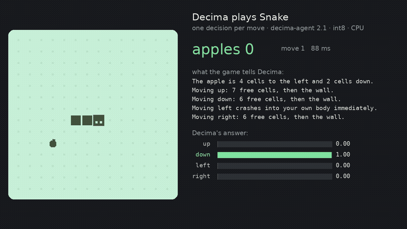

# Decima-agent: a local decision layer for coding agents

**Claude builds. Decima decides, on your machine. The hook enforces it.**

Decima-agent is a 321M-parameter System One model for the small, frequent decisions inside an agent loop:

- Does this file edit contain a real secret?
- Should this command run, or should it ask or be denied?
- Which tool fits this step, and which command does exactly this?
- What should happen next?
- Which model tier does this task need?

It returns calibrated probabilities instead of text, runs as int8 ONNX on a CPU, and nothing it judges ever leaves
the machine. It speaks TypeSafe's `/v1/systemone` wire format, so hooks written for Jev work after a one-line change.

Built by **A. M. Madani** ([@amyrmahdy](https://github.com/amyrmahdy)). The name: **DECI**sion **MA**king, and Decima
is also the Roman Fate who decides.

| On 130 hand-written agent decisions, held out from training | decima-base (no agent training) | decima-agent 2.0 | **decima-agent 2.1** |
|---|---:|---:|---:|
| Secret gate: real credential vs placeholder, env lookup, hash, docs example | 0.50 | 0.95 | **1.00** |
| Bash gate: allow / ask / deny under a stated policy | 0.77 | 0.95 | **0.95** |
| Command choice: the exact command among near misses (`reset --soft` vs `--hard`) | 0.33 | 0.93 | **0.93** |
| Next action: run / look first / test first / small model / escalate | 0.14 | 0.93 | **0.93** |
| Tool choice: Read, Grep, Glob, Edit, Write, Bash, WebFetch, WebSearch, ask the user | 0.50 | 0.83 | **0.92** |
| Model tier router: haiku / sonnet / opus / other | 0.93 | 1.00 | **0.93** |
| **All 130** | 0.58 | 0.90 | **0.93** |

> **Correction (2026-10-06).** These 130 cases are not fully held out. Near-copies of all 8 read-only cases, and some
> bash-gate commands verbatim, were in the training data (our own templates, and commands an LLM wrote). An earlier
> version of this card reported read-only 0.63 → 1.00 for 2.1; that measured memorisation, not skill, and is withdrawn.
> We wrote 40 new cases after the fact and checked that no exact or near copy of them is in any training data
> ([`agentbench-fresh.toml`](https://github.com/amyrmahdy/decima/blob/main/release/agent/agentbench-fresh.toml)); every
> training mix now drops rows that copy a test case ([`teacher/decontam_agent.py`](https://github.com/amyrmahdy/decima/blob/main/teacher/decontam_agent.py)).

| On 40 fresh cases (no copies in training) | decima-base | decima-agent 2.0 | **decima-agent 2.1** |
|---|---:|---:|---:|
| Read-only or not | 7/12 | 10/12 | **9/12** |
| Bash gate: allow / ask / deny | 11/18 | 15/18 | **15/18** |
| Secret gate | 6/10 | 8/10 | **9/10** |
| **All 40** | 0.60 | 0.83 | **0.83** |

On the fresh cases, agent training is clearly worth it (0.60 → 0.83), but 2.1 is no better than 2.0. The three dangerous
commands 2.1 misses (a public S3 upload, deleting a remote branch, uninstalling a production release) get "ask", not
"allow". The one bad miss: a Mailgun key (`key-` + 32 hex), a format it never saw, scored "not a secret" at 1.00.

- **Gates that catch what matters.** At the recommended thresholds (block at p ≥ 0.8, ask at p ≥ 0.3), **0**
  of the 9 real secrets in the 130-case set get through, and 1 of 5 in the fresh set (the Mailgun key above). Of the 9 dangerous commands, the model alone allows
  one (a `DELETE FROM` on a production database); the bash gate's rules block it. Keep the rules first.
- **Honest confidence.** Calibration error 0.035. 86 % of the decisions come with confidence ≥ 0.75, and those are
  right 98 % of the time. Send the rest to a bigger model or to a person.
- **Small and local.** int8 ONNX, 355 MB, about 50 ms on one CPU thread and about 20 ms on four (ARM cores of an NVIDIA GB10; short command, the question's options cached) per decision. States up to
  2,048 tokens, so a command plus recent turns and a diff fit.

Numbers are measured on the shipped int8 runtime. On this set fp32 gives the same accuracy (0.93), with an ECE of 0.037.

**What changed in 2.1 (2026-10-05).** Trained on what the first field logs showed: real agent commands look like
`cd <dir> && python -c "…"`, call services on the same machine, and clean up with `rm -rf`. 2.0 allowed
`rm -rf .loop/ data/` at 0.98 and denied a plain `curl 127.0.0.1:9000/health` at 0.96; 2.1 denies the first and
asks (or allows, under a local-services policy) for the second, at 0.99. On 1,000 held-out commands of that shape it is
right 99.9 % of the time (these procedural test sets come from the same generators as training, so they show the
skill was learned, not that it transfers). General decision accuracy is unchanged
(0.682 vs 0.681 on decima-base's five benchmark sets), and it plays Snake better: 32.4 apples a game, against about
21 for 2.0.



The game above is a typical one (28 apples, the median of ten), not the best. It ends the way 2.1 still loses: at
move 326 the game warns that going left leads into a closed pocket smaller than the snake, and the model goes left
anyway, toward the apple. That is the next thing to train.

## Quickstart: hooks for Claude Code

```bash
pip install "git+https://github.com/amyrmahdy/decima"
python -m decima.serve --model amyrmahdy/decima-agent --port 11436     # binds to 127.0.0.1
```

Then add the hooks from [`integrations/claude-code`](https://github.com/amyrmahdy/decima/tree/main/integrations/claude-code)
to `.claude/settings.json`:

| Hook | Rules first | Then Decima | If the server is down |
|---|---|---|---|
| `secret_gate.py` (Write, Edit) | known key formats → deny | deny ≥ 0.8, ask ≥ 0.3, else no opinion | ask |
| `bash_gate.py` (Bash) | destructive patterns → deny, plain read-only → allow | deny ≥ 0.6; ask if p(deny) ≥ 0.2 or unsure; else allow | ask |
| `route.py` (before a run) | — | cheapest tier that can do the task; one tier up when unsure | strongest tier |

**Run a week in shadow mode first (`DECIMA_SHADOW=1`).** The hooks decide and log to `~/.decima/decisions.jsonl` but
never enforce. Thresholds tuned on one model or project do not carry over to another. The log is also the training
set for a gate tuned to your own team's decisions.

## Use it directly

```python
from decima import Decima, Question

m = Decima.from_pretrained("amyrmahdy/decima-agent")
q = Question("Which command does exactly this?",
             ["git reset --soft HEAD~1", "git reset --hard HEAD~1", "git revert HEAD", "git commit --amend"])
d = m.decide('{"goal": "undo the last commit but keep my changes"}', q)
print(d.top, max(d.probs))
```

The same model answers through `/v1/systemone` (choice, noul and score), so the official `typesafe-sdk` works against
`http://127.0.0.1:11436` unchanged.

## What it was trained on

decima-agent is [decima-base](https://huggingface.co/amyrmahdy/decima-base) (mmBERT-base, 321M) fine-tuned on about
160k agent decisions, with about 55k rows of decima-base's own training mix replayed so its general skills stay. 2.1
continues from 2.0 on 225k rows (new key formats, subtle read-only commands, a larger command catalogue, real-shape
shell commands, Snake trap states, and 70k of 2.0's rows) plus 40k replayed general rows.
Every agent label is either exact or agreed by two models:

- **Exact, from code:**
  - real-format credentials vs placeholders, env lookups, docs example keys, hashes, UUIDs and public keys;
  - a policy-labelled command catalogue (read-only, build/test, recoverable change, destructive, exfiltration, root,
    pipe-to-shell);
  - tool and command choices with near-miss distractors;
  - next actions from rules over the situation;
  - test-run and ops-alert outcomes.
- **Written by Qwen3-Coder and checked by Gemma:**
  - realistic files with a credential slot that code fills, so the label is exact;
  - realistic commands, tasks and steps, where a row is kept only when the blind second model agrees.
- About a third of the states are wrapped in a long agent context (recent turns, file list, a diff), so the decisive
  line has to be found in 0.5–2k tokens.

The agent data is public: [amyrmahdy/decima-agent-decisions](https://huggingface.co/datasets/amyrmahdy/decima-agent-decisions)
(about 400k rows, with the held-out test splits and the 130 hand-written cases).

The hand-written evaluation set was written separately from all generators. The procedural test splits hold out key
formats, file types, command families, tools and phrasings, and are reported separately in the agentbench files.

## Limitations

- **Never the only line of defence.** Keep hard rules, your sandbox, permission settings and secret scanning in CI.
  Decima removes routine prompts; it does not replace those.
- **Unseen formats and commands are weaker.**
  - On the held-out procedural secret set, where half the credential formats never appear in training, accuracy is 0.75.
  - In realistic files from project types never seen in training, written by an LLM, 25 of 145 real credentials score
    below the ask threshold, so the model alone would let them through. The secret gate's regex rules cover the common
    vendor formats; keep secret scanning in CI.
  - On the held-out command test, where half the goals come from catalogue entries never seen in training, accuracy
    is 0.70. On commands for tool families never seen in training (terraform, helm, gcloud, rsync, openssl), written
    by an LLM, it is 0.26 with five options: do not trust it there.
- **"Did the tests pass?"** is right on 6 of 8 hand-written cases.
- **English agent data only.** The underlying model is multilingual, but the agent skills were trained and tested in
  English.
- **General classification is better on decima-base.** Fine-tuning for agent decisions costs a little general accuracy
  (0.703 → 0.682 on decima-base's five benchmark sets), and its general calibration is looser (ECE 0.10 vs 0.05).
- Small hand-written subsets (6–22 cases per decision) mean wide error bars; the procedural and LLM-written test sets
  are larger but are not real logs.

## License and citation

Apache-2.0. The base encoder is [jhu-clsp/mmBERT-base](https://huggingface.co/jhu-clsp/mmBERT-base) (MIT). Training data
licensing is described in the [repository](https://github.com/amyrmahdy/decima/blob/main/release/LICENSING.md).

```bibtex
@software{madani2026decima,
  author = {Madani, Amir Mahdi},
  title  = {Decima: open, calibrated decision models},
  year   = {2026},
  url    = {https://github.com/amyrmahdy/decima}
}
```
